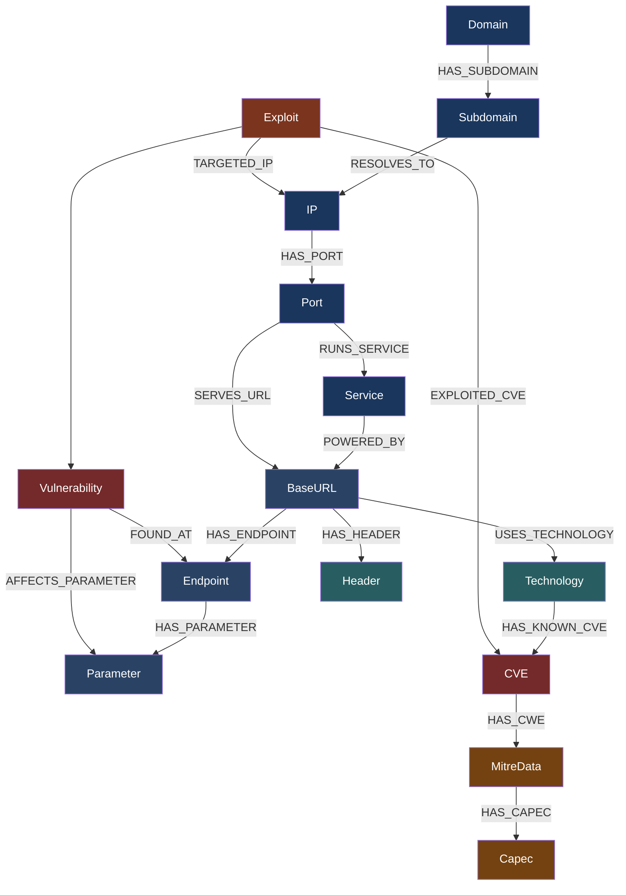
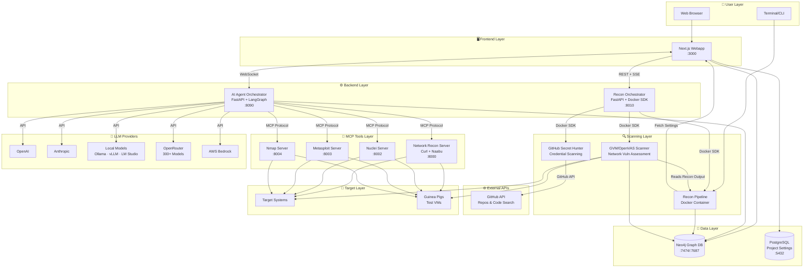
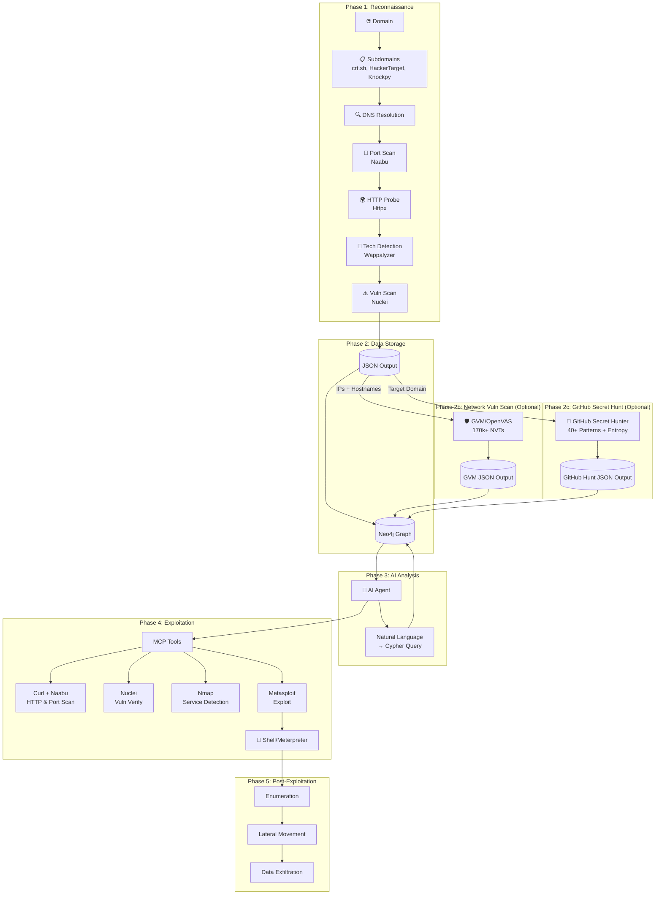
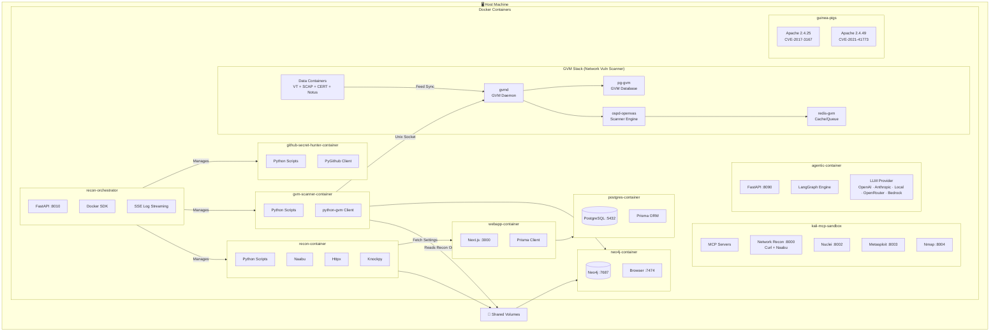
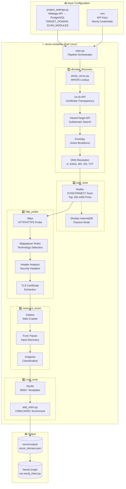
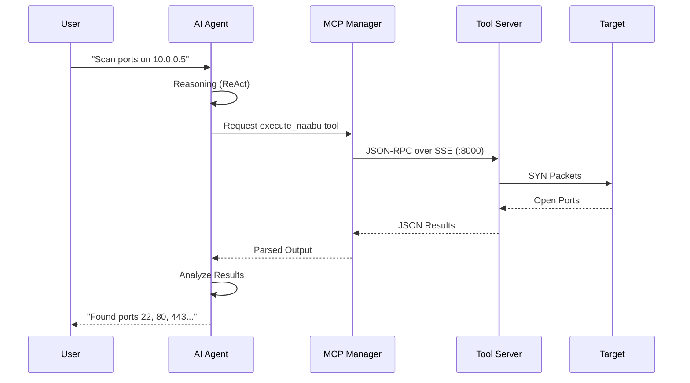

<p align="center">
  
  <br/>
  
</p>

<h3 align="center">Unmask the hidden before the world does.</h3>

<p align="center">
  An AI-powered agentic red team framework that automates offensive security operations, from reconnaissance to exploitation to post-exploitation, with zero human intervention.
</p>

<p align="center">
  
  
  
  <br/>
  
  
  
  
  
  
  
  
  
  
  
  
</p>

> **LEGAL DISCLAIMER**: This tool is intended for **authorized security testing**, **educational purposes**, and **research only**. Never use this system to scan, probe, or attack any system you do not own or have explicit written permission to test. Unauthorized access is **illegal** and punishable by law. By using this tool, you accept **full responsibility** for your actions. **[Read Full Disclaimer](DISCLAIMER.md)**

<p align="center">
  
</p>

---

## Quick Start

### Prerequisites

- [Docker](https://docs.docker.com/get-docker/) & Docker Compose v2+

That's it. No Node.js, Python, or security tools needed on your host.

#### Minimum System Requirements

| Resource | Without OpenVAS | With OpenVAS (full stack) |
|----------|----------------|--------------------------|
| **CPU** | 2 cores | 4 cores |
| **RAM** | 4 GB | 8 GB (16 GB recommended) |
| **Disk** | 20 GB free | 50 GB free |

> **Without OpenVAS** runs 6 containers: webapp, postgres, neo4j, agent, kali-sandbox, recon-orchestrator.
> **With OpenVAS** adds 4 more runtime containers (gvmd, ospd-openvas, gvm-postgres, gvm-redis) plus ~8 one-shot data-init containers for vulnerability feeds (~170K+ NVTs). First launch takes ~30 minutes for GVM feed synchronization.
> Dynamic recon and scan containers are spawned on-demand during operations and require additional resources.

### 1. Clone & Configure

```bash
git clone https://github.com/samugit83/redamon.git
cd redamon
cp .env.example .env
```

Edit `.env` and add at least one AI provider key:
```env
ANTHROPIC_API_KEY=sk-ant-...   # recommended
# or
OPENAI_API_KEY=sk-proj-...
```
Get your key from [Anthropic Console](https://console.anthropic.com/) or [OpenAI Platform](https://platform.openai.com/api-keys).

**Additional AI providers** (optional — add these to unlock more models):
```env
OPENAI_COMPAT_BASE_URL=http://host.docker.internal:11434/v1  # OpenAI-compatible endpoint (e.g. Ollama on host)
OPENAI_COMPAT_API_KEY=                                        # optional (fallback token "ollama" is used if empty)
OPENROUTER_API_KEY=sk-or-...   # OpenRouter — access 300+ models (Llama, Gemini, Mistral, etc.) via openrouter.ai
AWS_ACCESS_KEY_ID=AKIA...      # AWS Bedrock — access foundation models (Claude, Titan, Llama, etc.)
AWS_SECRET_ACCESS_KEY=...      # AWS Bedrock secret key
AWS_DEFAULT_REGION=us-east-1   # AWS Bedrock region (default: us-east-1)
```
The model selector in the project settings **dynamically fetches** available models from each provider whose API key is configured. Only providers with valid keys are shown.

**Optional keys** (add these for extra capabilities):
```env
TAVILY_API_KEY=tvly-...        # Web search for the AI agent — get one at tavily.com
NVD_API_KEY=...                # NIST NVD API — higher rate limits for CVE lookups — nist.gov/developers
```

### 2. Build & Start

```bash
docker compose --profile tools build          # Build all images (recon + vuln-scanner + services)
docker compose up -d                          # Start all services (first GVM run takes ~30 min for feed sync)
                                              # Total image size: ~15 GB
```

**Without GVM (lighter, faster startup):**
```bash
docker compose --profile tools build          # Build all images
docker compose up -d postgres neo4j recon-orchestrator kali-sandbox agent webapp   # Start core services only
```

### 3. Open the Webapp

Go to **http://localhost:3000** — create a project, configure your target, and start scanning.

### Common Commands

```bash
docker compose up -d                        # Start all services (including GVM)
docker compose down                         # Stop all services (keeps data)
docker compose ps                           # Check service status
docker compose logs -f                      # Follow all logs
docker compose logs -f webapp               # Webapp (Next.js)
docker compose logs -f agent                # AI agent orchestrator
docker compose logs -f recon-orchestrator   # Recon orchestrator
docker compose logs -f kali-sandbox         # MCP tool servers
docker compose logs -f gvmd                 # GVM vulnerability scanner daemon
docker compose logs -f neo4j                # Neo4j graph database
docker compose logs -f postgres             # PostgreSQL database

# Stop services without removing volumes (preserves all data, fast restart)
docker compose down

# Stop and remove locally built images (forces rebuild on next start)
docker compose --profile tools down --rmi local

# Full cleanup: remove all containers, images, and volumes (destroys all data!)
docker compose --profile tools down --rmi local --volumes --remove-orphans
```

### Development Mode

For active development with **Next.js fast refresh** (no rebuild on every change):

```bash
docker compose -f docker-compose.yml -f docker-compose.dev.yml up -d
```

**Without GVM (lighter, faster startup):**
```bash
docker compose -f docker-compose.yml -f docker-compose.dev.yml up -d postgres neo4j recon-orchestrator kali-sandbox agent webapp
```

The first command starts **all** services including GVM/OpenVAS (which requires a ~30 min feed sync on first run). The second command starts only the core services, skipping GVM entirely — useful when you don't need network-level vulnerability scanning and want a faster, lighter stack.

Both commands swap the production webapp image for a dev container with your source code volume-mounted. Every file save triggers instant hot-reload in the browser.

**Refreshing Python services after code changes:**

The Python services (`agent`, `recon-orchestrator`, `kali-sandbox`) already have their source code volume-mounted, so files are synced live. However, the running Python process won't pick up changes until you restart the container:

```bash
# Restart a single service (picks up code changes instantly)
docker compose restart agent              # AI agent orchestrator
docker compose restart recon-orchestrator  # Recon orchestrator
docker compose restart kali-sandbox       # MCP tool servers
```

No rebuild needed — just restart.

---

## Table of Contents

- [Overview](#overview)
  - [Reconnaissance Pipeline](#reconnaissance-pipeline)
  - [AI Agent Orchestrator](#ai-agent-orchestrator)
  - [AI Model Providers](#ai-model-providers)
  - [Local Models & OpenAI-Compatible Providers](#openai-compatible-provider)
  - [GitHub Secret Hunter](#github-secret-hunter)
  - [GVM Vulnerability Scanner](#gvm-vulnerability-scanner-optional)
  - [Attack Surface Graph](#attack-surface-graph)
  - [Project Settings](#project-settings)
- [System Architecture](#system-architecture)
  - [High-Level Architecture](#high-level-architecture)
  - [Data Flow Pipeline](#data-flow-pipeline)
  - [Docker Container Architecture](#docker-container-architecture)
  - [Exposed Services & Ports](#exposed-services--ports)
- [Components](#components)
  - [Reconnaissance Pipeline](#1-reconnaissance-pipeline)
  - [Graph Database](#2-graph-database)
  - [MCP Tool Servers](#3-mcp-tool-servers)
  - [AI Agent Orchestrator](#4-ai-agent-orchestrator)
  - [Web Application](#5-web-application)
  - [GVM Scanner](#6-gvm-scanner)
  - [GitHub Secret Hunter](#7-github-secret-hunter)
  - [Test Environments](#8-test-environments)
- [Technology Stack](#technology-stack)
  - [Frontend](#frontend)
  - [Backend & API](#backend--api)
  - [AI & LLM](#ai--llm)
  - [Databases](#databases)
  - [Security & Penetration Testing Tools](#security--penetration-testing-tools)
  - [Vulnerability Assessment](#vulnerability-assessment)
  - [Data Sources & Threat Intelligence](#data-sources--threat-intelligence)
  - [Infrastructure & DevOps](#infrastructure--devops)
  - [Protocols & Communication](#protocols--communication)
- [Development Mode](#development-mode)
- [Documentation](#documentation)
- [Legal](#legal)

---

## Overview

RedAmon is a modular, containerized penetration testing framework that chains automated reconnaissance, AI-driven exploitation, and graph-powered intelligence into a single, end-to-end offensive security pipeline. Every component runs inside Docker — no tools installed on your host — and communicates through well-defined APIs so each layer can evolve independently.

The platform is built around four pillars:

| Pillar | What it does |
|--------|-------------|
| **Reconnaissance Pipeline** | Six sequential scanning phases that map your target's entire attack surface — from subdomain discovery to vulnerability detection — and store the results as a rich, queryable graph. Complemented by standalone GVM network scanning and GitHub secret hunting modules. |
| **AI Agent Orchestrator** | A LangGraph-based autonomous agent that reasons about the graph, selects security tools via MCP, transitions through informational / exploitation / post-exploitation phases, and can be steered in real-time via chat. |
| **Attack Surface Graph** | A Neo4j knowledge graph with 17 node types and 20+ relationship types that serves as the single source of truth for every finding — and the primary data source the AI agent queries before every decision. |
| **Project Settings Engine** | 180+ per-project parameters — exposed through the webapp UI — that control every tool's behavior, from Naabu thread counts to Nuclei severity filters to agent approval gates. |

---

### Reconnaissance Pipeline

The recon pipeline is a fully automated, six-phase scanning engine that runs inside a Kali Linux container. Given a single root domain (or a specific subdomain list), it progressively builds a complete picture of the target's external attack surface. Each phase feeds its output into the next, and the final result is both a structured JSON file and a populated Neo4j graph.

<p align="center">
  
</p>

#### Phase 1 — Domain Discovery

The pipeline starts by mapping the target's subdomain landscape using three complementary techniques:

- **Certificate Transparency** via crt.sh — queries the public CT logs to find every certificate ever issued for the root domain, extracting subdomain names from Subject and SAN fields.
- **HackerTarget API** — a passive lookup that returns known subdomains without sending any traffic to the target.
- **Knockpy** (optional brute-force) — an active subdomain bruteforcer that tests thousands of common prefixes against the target's DNS. Controlled by the `useBruteforceForSubdomains` toggle.
- **WHOIS Lookup** — retrieves registrar, registrant, creation/expiration dates, name servers, and contact information with automatic retry logic and exponential backoff.
- **DNS Resolution** — resolves every discovered subdomain to its A, AAAA, MX, NS, TXT, CNAME, and SOA records, building a map of IP addresses and mail infrastructure.

When a specific `subdomainList` is provided (e.g., `www.`, `api.`, `mail.`), the pipeline skips active discovery and only resolves the specified subdomains — useful for focused assessments.

#### Phase 2 — Port Scanning

All resolved IP addresses are fed into **Naabu**, a fast SYN/CONNECT port scanner. Key capabilities:

- **SYN scanning** (default) with automatic fallback to CONNECT mode if raw sockets are unavailable.
- Top-N port selection (100, 1000, or custom port ranges).
- **CDN/WAF detection** — identifies Cloudflare, Akamai, AWS CloudFront and other CDN providers, optionally excluding them from deeper scans.
- **Passive mode** — queries Shodan's InternetDB instead of sending packets, for zero-touch reconnaissance.
- **IANA service lookup** — maps port numbers to service names using the 15,000-entry IANA registry.

#### Phase 3 — HTTP Probing & Technology Detection

Every host+port combination is probed over HTTP/HTTPS using **httpx** to determine which services are live and what they run:

- **Response metadata** — status codes, content types, page titles, server headers, response times, word/line counts.
- **TLS inspection** — certificate subject, issuer, expiry, cipher suite, JARM fingerprint.
- **Technology fingerprinting** — a dual-engine approach:
  - httpx's built-in detection identifies major frameworks and servers.
  - **Wappalyzer** (6,000+ fingerprints, auto-updated from npm) performs a second pass on the response HTML, catching CMS plugins, JavaScript libraries, and analytics tools that httpx misses. The merge is fully automatic with configurable minimum confidence thresholds.
- **Banner grabbing** — for non-HTTP ports (SSH, FTP, SMTP, MySQL, Redis, etc.), raw socket connections extract service banners and version strings using protocol-specific probe strings.

#### Phase 4 — Resource Enumeration

Three tools run **in parallel** (via ThreadPoolExecutor) to discover every reachable endpoint on the live URLs:

- **Katana** — an active web crawler that follows links to a configurable depth, optionally rendering JavaScript to discover dynamic routes. Extracts forms, input fields, and query parameters.
- **GAU** (GetAllUrls) — a passive discovery tool that queries the Wayback Machine, Common Crawl, AlienVault OTX, and URLScan.io for historical URLs. Results are verified with httpx to filter out dead links, and HTTP methods are detected via OPTIONS probes.
- **Kiterunner** — an API-specific brute-forcer that tests wordlists of common API routes (REST, GraphQL) against each base URL, detecting allowed HTTP methods (GET, POST, PUT, DELETE, PATCH).

Results are merged, deduplicated, and organized by base URL. Every endpoint is classified into categories (auth, file_access, api, dynamic, static, admin) and its parameters are typed (id, file, search, auth_param).

#### Phase 5 — Vulnerability Scanning

The discovered endpoints — especially those with query parameters — are fed into **Nuclei**, a template-based vulnerability scanner with 8,000+ community templates:

- **DAST mode** (active fuzzing) — injects XSS, SQLi, RCE, LFI, SSRF, and SSTI payloads into every discovered parameter. This catches vulnerabilities that signature-only scanning misses.
- **Severity filtering** — scan for critical, high, medium, and/or low findings.
- **Interactsh integration** — out-of-band detection for blind vulnerabilities (SSRF, XXE, blind SQLi) via callback servers.
- **CVE enrichment** — each finding is cross-referenced against the NVD (or Vulners) API for CVSS scores, descriptions, and references.
- **30+ custom security checks** — direct IP access, missing security headers (CSP, HSTS, Referrer-Policy, Permissions-Policy, COOP, CORP, COEP), TLS certificate expiry, DNS security (SPF, DMARC, DNSSEC, zone transfer), open services (Redis without auth, exposed Kubernetes API, SMTP open relay), insecure form actions, and missing rate limiting.

#### Phase 6 — MITRE Enrichment

- **MITRE CWE/CAPEC mapping** — every CVE found in Phase 5 is automatically enriched with its corresponding CWE weakness and CAPEC attack patterns, using an auto-updated database from the CVE2CAPEC repository (24-hour cache TTL).

#### Output

All results are combined into a single JSON file (`recon/output/recon_{PROJECT_ID}.json`) and simultaneously imported into the Neo4j graph database, creating a fully connected knowledge graph of the target's attack surface.

#### Running Reconnaissance

1. Create a project with target domain and settings
2. Navigate to Graph page
3. Click "Start Recon" button
4. Watch real-time logs in the drawer

---

### GVM Vulnerability Scanner (Optional)

After reconnaissance completes, you can optionally run a **GVM/OpenVAS network-level vulnerability scan** to complement the web-layer findings from Nuclei.

#### What is GVM/OpenVAS?

**Greenbone Vulnerability Management (GVM)** — formerly known as OpenVAS — is the world's largest open-source network vulnerability scanner. While Nuclei focuses on web application testing via HTTP templates, GVM operates at a fundamentally different level: it probes services directly at the **protocol layer**, testing for misconfigurations, outdated software, default credentials, and known CVEs across every open port.

The GVM ecosystem consists of several components working together:

- **OpenVAS Scanner (ospd-openvas)** — the scanning engine that executes Network Vulnerability Tests (NVTs) against targets, performing actual protocol-level probes (SSH version checks, SMB enumeration, TLS cipher analysis, banner fingerprinting).
- **GVM Daemon (gvmd)** — the central management service that orchestrates scans, manages scan configs, stores results, and exposes the GMP (Greenbone Management Protocol) API.
- **Vulnerability Feed** — a continuously updated database of **170,000+ NVTs** covering operating systems, network services, databases, embedded devices, industrial control systems, and more — the largest open-source vulnerability test feed available.
- **PostgreSQL + Redis** — backend storage for scan results, NVT metadata, and inter-process communication.

What makes GVM particularly powerful is its **depth of testing**. Unlike signature-based scanners that match HTTP responses against patterns, GVM actively negotiates protocols, authenticates to services, checks software versions against vulnerability databases, tests for default credentials, and probes for misconfigurations that are invisible at the HTTP layer — things like weak SSH ciphers, exposed database ports with no authentication, SNMP community string guessing, and SMB vulnerabilities.

#### Scan Profiles & Time Estimates

GVM includes seven pre-configured scan profiles, each trading thoroughness for speed. Times below are per-target estimates:

| Scan Profile | NVTs | Duration | Description |
|---|---|---|---|
| **Host Discovery** | ~100 | 2-5 min | Basic host detection — is the target alive? |
| **Discovery** | ~500 | 5-10 min | Network discovery — open ports, running services, OS fingerprint |
| **System Discovery** | ~2,000 | 10-20 min | Detailed OS and service enumeration for asset inventory |
| **Full and fast** | ~50,000 | 30-60 min | Comprehensive vulnerability scan using port scan results to select relevant NVTs — **recommended default** |
| **Full and fast ultimate** | ~70,000 | 1-2 hours | Same as above but includes dangerous NVTs that may crash services or hosts |
| **Full and very deep** | ~50,000 | 2-4 hours | Ignores previously collected port/service data and runs all NVTs unconditionally — waits for timeouts on every test, significantly slower |
| **Full and very deep ultimate** | ~70,000 | 4-8 hours | Most thorough and slowest option — runs all NVTs including dangerous ones, ignores prior scan data, waits for all timeouts |

The key difference between "fast" and "very deep" profiles is how they use prior information: **fast** profiles leverage port scan results to skip irrelevant NVTs (e.g., skipping SSH checks on a host with no port 22), while **very deep** profiles ignore all prior data and execute every NVT unconditionally, waiting for timeouts on non-responding services. The "ultimate" variants add NVTs that may cause denial-of-service conditions on the target — use them only in controlled lab environments.

> **Note:** The first GVM startup requires a one-time feed synchronization that takes ~30 minutes. Subsequent starts are instant.

#### Integration with RedAmon

GVM findings are stored as Vulnerability nodes (`source="gvm"`) in Neo4j, linked to IP and Subdomain nodes via `HAS_VULNERABILITY` relationships, with associated CVE nodes. This means the AI agent can reason about both web-layer vulnerabilities (from Nuclei) and network-layer vulnerabilities (from GVM) in a single unified graph.

#### Running a GVM Scan

1. GVM starts automatically with `docker compose up -d` (first run takes ~30 min for feed sync)
2. Navigate to Graph page
3. Click the "GVM Scan" button (enabled only when recon data exists for the project)
4. Watch real-time logs in the GVM logs drawer
5. Download the GVM results JSON when complete

> **Note:** Default GVM credentials are `admin` / `admin` (auto-created by gvmd on first start).

---

### AI Agent Orchestrator

The AI agent is a **LangGraph-based autonomous system** that implements the ReAct (Reasoning + Acting) pattern. It operates in a loop — reason about the current state, select and execute a tool, analyze the results, repeat — until the objective is complete or the user stops it.

#### Three Execution Phases

The agent progresses through three distinct operational phases, each with different tool access and objectives:

**Informational Phase** — The default starting phase. The agent gathers intelligence by querying the Neo4j graph, running web searches for CVE details, performing HTTP requests with curl, and scanning ports with Naabu. No offensive tools are available. The agent analyzes the attack surface, identifies high-value targets, and builds a mental model of what's exploitable.

**Exploitation Phase** — When the agent identifies a viable attack path, it requests a phase transition. This requires **user approval** (configurable). Once approved, the agent gains access to the Metasploit console via MCP and can execute exploits. Two attack paths are supported:

- **CVE Exploit** — the agent searches for a matching Metasploit module, configures the payload (reverse shell or bind shell), sets target parameters, and fires the exploit. For statefull mode, it establishes a Meterpreter session; for stateless mode, it executes one-shot commands.
- **Hydra Brute Force** — the agent uses THC Hydra to brute force credentials against services like SSH, FTP, RDP, SMB, MySQL, HTTP forms, and 50+ other protocols. Hydra settings (threads, timeouts, extra checks) are fully configurable per project. After credentials are discovered, the agent establishes access via `sshpass`, database clients, or Metasploit psexec.

When an exploit succeeds, the agent automatically creates an **Exploit node** in the Neo4j graph — recording the attack type, target IP, port, CVE IDs, Metasploit module used, payload, session ID, and any credentials discovered. This node is linked to the targeted IP, the exploited CVE, and the entry port, making every successful compromise a permanent, queryable part of the attack surface graph.

<p align="center">
  
</p>

**Post-Exploitation Phase** — After a successful exploit, the agent can optionally transition to post-exploitation (if enabled). In statefull mode (Meterpreter), it runs interactive commands — enumeration, lateral movement, data exfiltration. In stateless mode, it re-runs exploits with different command payloads. This phase also requires user approval.

#### Chat-Based Graph Interaction

Users interact with the agent through a real-time **WebSocket chat interface** in the webapp. You can ask natural language questions and the agent will automatically translate them into Cypher queries against the Neo4j graph:

- *"What vulnerabilities exist on 192.168.1.100?"* — the agent generates a Cypher query, injects tenant filters (so you only see your project's data), executes it, and returns the results in natural language.
- *"Which technologies have critical CVEs?"* — traverses the Technology → CVE relationship chain.
- *"Show me all open ports on the subdomains of example.com"* — walks the Subdomain → IP → Port path.
- *"Find all endpoints with injectable parameters"* — queries Parameter nodes marked as injectable by Nuclei.

The text-to-Cypher system includes 25+ example patterns, handles the critical distinction between Vulnerability nodes (scanner findings, lowercase severity) and CVE nodes (NVD entries, uppercase severity), and automatically retries with error context if a query fails (up to 3 attempts).

#### Real-Time Control

The agent runs as a background task, keeping the WebSocket connection free for control messages:

- **Guidance** — send steering messages while the agent works (e.g., *"Focus on SSH vulnerabilities, ignore web apps"*). These are injected into the system prompt before the next reasoning step.
- **Stop** — pause execution at any point. The agent's state is checkpointed via LangGraph's MemorySaver.
- **Resume** — continue from the last checkpoint with full context preserved.
- **Approval workflows** — phase transitions to exploitation or post-exploitation pause the agent and present a structured request (reason, planned actions, risks) for the user to approve, modify, or abort.

#### MCP Tool Integration

The agent executes security tools through the **Model Context Protocol**, with each tool running in a dedicated server inside the Kali sandbox container:

| Tool | Purpose | Available In |
|------|---------|-------------|
| **query_graph** | Neo4j Cypher queries for target intelligence | All phases |
| **web_search** | Tavily-based CVE/exploit research | All phases |
| **execute_curl** | HTTP requests, API probing, header inspection | All phases |
| **execute_naabu** | Fast port scanning and service detection | All phases |
| **execute_nmap** | Deep service analysis, OS fingerprinting, NSE scripts | All phases |
| **execute_nuclei** | Vulnerability scanning with 9,000+ templates | All phases |
| **kali_shell** | Direct Kali Linux shell commands (arbitrary command execution) | All phases |
| **execute_code** | Run custom Python/Bash exploit scripts on the Kali sandbox | Exploitation & Post-exploitation |
| **execute_hydra** | THC Hydra brute force password cracking (50+ protocols) | Exploitation & Post-exploitation |
| **metasploit_console** | Exploit execution, payload delivery, sessions | Exploitation & Post-exploitation |
| **msf_restart** | Restart Metasploit RPC daemon when it becomes unresponsive | Exploitation & Post-exploitation |

For long-running operations (e.g., Hydra brute force with large wordlists, Metasploit exploits), the agent streams progress updates every 5 seconds to the WebSocket, so you see output in real time.

#### Kali Sandbox Tooling

Beyond the MCP tools listed above, the `kali_shell` and `execute_code` tools give the agent access to the **full Kali Linux toolkit** installed in the sandbox container. The agent can invoke any of these directly via shell commands or compile and run custom exploit scripts on the fly.

**Exploitation & Offensive**

| Tool | Description |
|------|-------------|
| **Metasploit Framework** | Full exploitation framework — exploits, payloads, encoders, auxiliaries, Meterpreter sessions |
| **SQLMap** | Automatic SQL injection detection and exploitation |
| **ExploitDB** | Local copy of the Exploit Database — offline CVE exploit search |
| **John the Ripper** | Password cracker — dictionary, brute force, and rule-based attacks |

**Network & Reconnaissance**

| Tool | Description |
|------|-------------|
| **Nmap** | Network mapper — port scanning, service detection, OS fingerprinting, NSE scripts |
| **Naabu** | Fast SYN/CONNECT port scanner from ProjectDiscovery |
| **Nuclei** | Template-based vulnerability scanner with 9,000+ community templates |
| **curl** | HTTP/HTTPS client — API probing, header inspection, file upload/download |
| **wget** | File download utility |
| **Netcat (nc)** | Swiss-army knife for TCP/UDP — reverse shells, port listeners, data transfer |
| **Socat** | Advanced socket relay — bidirectional data streams, port forwarding, SSL tunnels |
| **dig / nslookup / host** | DNS reconnaissance — record lookups, zone transfers, reverse DNS |
| **SMBClient** | SMB/CIFS protocol client — share enumeration, file access, authentication testing |

**Programming & Scripting**

| Tool | Description |
|------|-------------|
| **Python 3** | Full Python interpreter — write and run custom exploit scripts, parsers, automation |
| **Perl** | Perl interpreter — legacy exploit scripts and text processing |
| **GCC / G++** | C/C++ compilers — compile custom exploits, shellcode, and binary tools on-the-fly |
| **Make** | Build automation for multi-file exploit projects |
| **Go 1.25** | Go compiler — build Go-based security tools from source |
| **Git** | Clone exploit repositories and security tools at runtime |

**Utilities**

| Tool | Description |
|------|-------------|
| **jq** | JSON processor — parse API responses, filter scan results |
| **rlwrap** | Readline wrapper — enhanced interactive shell sessions |
| **net-tools** | Network utilities — `netstat`, `ifconfig`, routing tables |
| **iputils-ping** | ICMP ping for host discovery |

> **Note:** The container runs with `NET_ADMIN`, `NET_RAW`, and `SYS_PTRACE` capabilities, enabling raw socket operations (SYN scanning), packet capture, and process debugging. The agent can also compile and execute C/C++ exploits in-place using `execute_code`.

#### Attack Path Routing

The agent uses an **LLM-powered Intent Router** to classify each user request into the appropriate attack path category. Rather than following a single, fixed exploitation workflow, the router analyzes the user's objective, the available target intelligence from the Neo4j graph, and the current operational phase to select the correct attack chain — each with its own Metasploit workflow, tool sequence, and post-exploitation behavior.

The architecture supports **10 attack path categories** (CVE exploitation, brute force, social engineering, DoS, fuzzing, credential capture, wireless attacks, web application attacks, client-side exploitation, and local privilege escalation), with an implementation roadmap to progressively enable each one. Attack paths can also **chain into each other** — for example, a credential capture can feed captured usernames into a brute force attack, or a fuzzing discovery can chain into CVE research and exploitation.

**Currently implemented attack paths:**

| # | Attack Path | Description | Module Type | Post-Exploitation |
|---|-------------|-------------|-------------|-------------------|
| 1 | **CVE-Based Exploitation** | Exploits known vulnerabilities identified by CVE identifier. The agent searches for a matching Metasploit exploit module, configures target parameters and payload (reverse/bind shell), and fires the exploit. Supports both statefull (Meterpreter session) and stateless (one-shot command) post-exploitation. | `exploit/*` | Yes |
| 2 | **Hydra Brute Force** | Password guessing attacks against 50+ authentication protocols (SSH, FTP, RDP, SMB, MySQL, HTTP forms, and more). The agent uses THC Hydra (`execute_hydra`) with configurable threads, timeouts, and retry strategies. After credentials are discovered, the agent establishes access via `sshpass` (SSH), database clients, or Metasploit psexec (SMB). | `execute_hydra` | Sometimes (SSH, SMB) |

For full details on all 10 attack path categories, the intent router architecture, chain-specific workflows, and the implementation roadmap, see the **[Attack Paths Documentation](agentic/README.ATTACK_PATHS.md)**.

---

### AI Model Providers

RedAmon supports **five AI providers** out of the box, giving you access to **400+ language models** through a single, unified interface. The model selector in the project settings **dynamically fetches** available models from each configured provider — no hardcoded lists, no manual updates. When a provider releases a new model, it appears automatically.

| Provider | Models | Pricing | API Key Required |
|----------|--------|---------|-----------------|
| **OpenAI** (Direct) | ~30 chat models — GPT-5.2, GPT-5, GPT-4.1, o3, o4-mini, and more | Pay-per-token via OpenAI | `OPENAI_API_KEY` |
| **Anthropic** (Direct) | ~15 models — Claude Opus 4.6, Sonnet 4.6/4.5, Haiku 4.5 | Pay-per-token via Anthropic | `ANTHROPIC_API_KEY` |
| **OpenAI-Compatible** | Any self-hosted or third-party OpenAI-compatible API (for example Ollama, local gateways, proxies). Model lists come directly from your backend; choose chat-capable models manually | Depends on your backend | `OPENAI_COMPAT_BASE_URL` (`OPENAI_COMPAT_API_KEY` optional) |
| **OpenRouter** | **300+ models** — Llama 4, Gemini 3, Mistral, Qwen, DeepSeek, Command R+, and hundreds more from 50+ providers routed through a single API | Variable per model (some free) | `OPENROUTER_API_KEY` |
| **AWS Bedrock** | ~60 foundation models — Claude, Titan, Llama, Cohere Command, Mistral, AI21 Jamba, and more | Pay-per-token via AWS | `AWS_ACCESS_KEY_ID` + `AWS_SECRET_ACCESS_KEY` |

#### How It Works

1. **Provider detection** — On startup, the agent checks which provider credentials/URLs are set in the environment. Only configured providers are queried.
2. **Dynamic model fetching** — The agent's `/models` endpoint fetches available models from all configured providers in parallel (OpenAI API, Anthropic API, OpenAI-compatible `/models`, OpenRouter API, AWS Bedrock `ListFoundationModels`). Results are cached for 1 hour.
3. **Searchable model selector** — The project settings UI presents a searchable dropdown grouped by provider. Each model shows its name, context window size, and pricing info. Type to filter across all providers instantly.
4. **Provider prefix convention** — Models are stored with a provider prefix (`openai_compat/`, `openrouter/`, `bedrock/`) so the agent knows which SDK to use at runtime. OpenAI and Anthropic models are detected by name pattern (no prefix needed). Existing projects continue to work unchanged.

> **Note (OpenAI-Compatible):** RedAmon does not automatically validate chat capability for models returned by your compatible backend. If the backend exposes embedding/audio/image models, select a chat model manually.

#### Provider Setup

```env
# .env — add the keys for the providers you want to use

# Direct providers (lowest latency, direct API connection)
OPENAI_API_KEY=sk-proj-...          # OpenAI — platform.openai.com/api-keys
ANTHROPIC_API_KEY=sk-ant-...        # Anthropic — console.anthropic.com

# OpenAI-compatible providers (self-hosted or third-party)
OPENAI_COMPAT_BASE_URL=http://host.docker.internal:11434/v1  # Example: Ollama running on your host
OPENAI_COMPAT_API_KEY=                                        # Optional; fallback token "ollama" is used if empty

# Gateway providers (access many models through one key)
OPENROUTER_API_KEY=sk-or-...        # OpenRouter — openrouter.ai/settings/keys

# AWS Bedrock (uses standard AWS credential chain)
AWS_ACCESS_KEY_ID=AKIA...           # IAM user with bedrock:InvokeModel permission
AWS_SECRET_ACCESS_KEY=...           # IAM secret key
AWS_DEFAULT_REGION=us-east-1        # Recommended: us-east-1 (N. Virginia) has the widest model availability
```

> **Note (Bedrock):** Foundation models on AWS Bedrock are now **automatically enabled** across all commercial regions when first invoked — no manual model access activation is required. Just create an IAM user with `bedrock:InvokeModel` and `bedrock:ListFoundationModels` permissions, set the credentials above, and start using any model immediately.

> **Tip:** You can configure multiple providers simultaneously. The model selector will show all available models from all configured providers, letting you switch between a free Llama model on OpenRouter for testing and Claude Opus on Anthropic for production assessments — without changing any code.

#### OpenAI-Compatible Provider

Any backend that exposes the standard `/v1/chat/completions` and `/v1/models` endpoints works out of the box with RedAmon. Set `OPENAI_COMPAT_BASE_URL` in your `.env` and matching models appear in the project settings dropdown automatically.

The agent container already includes `host.docker.internal` resolution, so local servers running on your host machine are reachable from Docker.

> **Linux users:** Most local LLM servers (Ollama, vLLM, etc.) listen on `localhost` by default, which is **not reachable** from Docker containers. You need to bind the server to all interfaces (`0.0.0.0`). For Ollama installed via the official script:
> ```bash
> sudo bash -c 'mkdir -p /etc/systemd/system/ollama.service.d && echo -e "[Service]\nEnvironment=\"OLLAMA_HOST=0.0.0.0\"" > /etc/systemd/system/ollama.service.d/override.conf'
> sudo systemctl daemon-reload && sudo systemctl restart ollama
> ```
> macOS and Windows (Docker Desktop) handle this automatically — no extra step needed.

**Self-hosted / local (free):**

| Provider | Description | Example `OPENAI_COMPAT_BASE_URL` |
|----------|-------------|----------------------------------|
| [Ollama](https://ollama.com/) | Easiest way to run local LLMs — single command setup | `http://host.docker.internal:11434/v1` |
| [vLLM](https://github.com/vllm-project/vllm) | High-performance GPU inference server | `http://host.docker.internal:8000/v1` |
| [LM Studio](https://lmstudio.ai/) | Desktop app with built-in local server | `http://host.docker.internal:1234/v1` |
| [LocalAI](https://localai.io/) | Open-source OpenAI drop-in replacement, runs on CPU | `http://host.docker.internal:8080/v1` |
| [Jan](https://jan.ai/) | Desktop app with ChatGPT-like UI and local server mode | `http://host.docker.internal:1337/v1` |
| [llama.cpp server](https://github.com/ggerganov/llama.cpp) | Lightweight C++ inference | `http://host.docker.internal:8080/v1` |
| [OpenLLM](https://github.com/bentoml/OpenLLM) | Run any open-source LLM with one command | `http://host.docker.internal:3000/v1` |
| [text-generation-webui](https://github.com/oobabooga/text-generation-webui) | Gradio UI with OpenAI-compatible API extension | `http://host.docker.internal:5000/v1` |

**Gateways / proxies (aggregate multiple providers behind one endpoint):**

| Provider | Description |
|----------|-------------|
| [LiteLLM](https://github.com/BerriAI/litellm) | Proxy for 100+ LLMs in OpenAI format — self-hostable via Docker |

**Cloud providers with OpenAI-compatible API:**

| Provider | Description |
|----------|-------------|
| [Together AI](https://together.ai/) | 200+ open-source models, serverless |
| [Groq](https://groq.com/) | Ultra-fast inference for Llama, Mixtral, Gemma |
| [Fireworks AI](https://fireworks.ai/) | Fast open-source model hosting |
| [Deepinfra](https://deepinfra.com/) | Pay-per-token open-source models |
| [Mistral AI](https://mistral.ai/) | Mistral / Mixtral models via OpenAI-compatible endpoint |
| [Perplexity](https://www.perplexity.ai/) | Sonar models via OpenAI-compatible API |

> **Note:** RedAmon fetches all models from your compatible endpoint, including non-chat models (embeddings, audio, image). Make sure to select a **chat-capable** model in project settings.

---

### Attack Surface Graph

The Neo4j graph database is the **single source of truth** for every finding in RedAmon. It stores the complete topology of the target's attack surface as an interconnected knowledge graph, enabling both visual exploration in the webapp and intelligent querying by the AI agent.

#### Node Types

The graph contains **17 node types** organized into four categories:

**Infrastructure Nodes** — represent the network topology:

| Node | Key Properties | Description |
|------|---------------|-------------|
| **Domain** | name, registrar, creation_date, expiration_date, WHOIS data | Root domain with full WHOIS information |
| **Subdomain** | name, has_dns_records | Discovered hostname |
| **IP** | address, version, is_cdn, cdn_name, asn | Resolved IP address with CDN/ASN metadata |
| **Port** | number, protocol, state | Open port on an IP |
| **Service** | name, product, version, banner | Running service with version info |

**Web Application Nodes** — represent the application layer:

| Node | Key Properties | Description |
|------|---------------|-------------|
| **BaseURL** | url, status_code, title, server, response_time_ms, resolved_ip | Live HTTP endpoint with full response metadata |
| **Endpoint** | path, method, has_parameters, is_form, source | Discovered URL path with HTTP method |
| **Parameter** | name, position (query/body/header/path), is_injectable | Input parameter, flagged when a vulnerability affects it |

**Technology & Security Nodes** — represent detected software and security posture:

| Node | Key Properties | Description |
|------|---------------|-------------|
| **Technology** | name, version, categories, confidence, detected_by, known_cve_count | Detected framework, library, or server |
| **Header** | name, value, is_security_header | HTTP response header |
| **Certificate** | subject_cn, issuer, not_after, san, tls_version | TLS certificate details |
| **DNSRecord** | type (A/AAAA/MX/NS/TXT/SOA), value, ttl | DNS record for a subdomain |

**Vulnerability & Exploitation Nodes** — represent security findings and successful attacks:

| Node | Key Properties | Description |
|------|---------------|-------------|
| **Vulnerability** | id, name, severity (lowercase), source (nuclei/gvm/security_check), category, curl_command | Scanner finding with evidence |
| **CVE** | id, cvss, severity (uppercase), description, published | Known vulnerability from NVD |
| **MitreData** | cve_id, cwe_id, cwe_name, abstraction | CWE weakness mapping |
| **Capec** | capec_id, name, likelihood, severity, execution_flow | Common attack pattern |
| **Exploit** | attack_type, target_ip, session_id, cve_ids, metasploit_module | Agent-created successful exploitation record |

#### Relationship Chain

The graph connects these nodes through a directed relationship chain that mirrors real-world infrastructure topology:



Vulnerabilities connect differently depending on their source:
- **Nuclei findings** (web application) → linked via `FOUND_AT` to the specific Endpoint and `AFFECTS_PARAMETER` to the vulnerable Parameter.
- **GVM findings** (network level) → linked via `HAS_VULNERABILITY` directly to the IP and Subdomain nodes, with associated CVE nodes.
- **Security checks** (DNS/email/headers) → linked via `HAS_VULNERABILITY` to the Subdomain or Domain.

#### How the Agent Uses the Graph

Before the agent takes any offensive action, it queries the graph to build situational awareness. This is the core intelligence loop:

1. **Attack surface mapping** — the agent queries the Domain → Subdomain → IP → Port → Service chain to understand what's exposed.
2. **Technology-CVE correlation** — traverses Technology → CVE relationships to find which detected software versions have known vulnerabilities, prioritizing by CVSS score.
3. **Injectable parameter discovery** — queries Parameter nodes flagged as `is_injectable: true` by Nuclei to identify confirmed injection points.
4. **Exploit feasibility assessment** — cross-references open ports, running services, and known CVEs to determine which Metasploit modules are likely to succeed.
5. **Post-exploitation context** — after a successful exploit, the agent creates an Exploit node linked to the target IP, CVE, and port, so subsequent queries can reference what's already been compromised.

All queries are automatically scoped to the current user and project via regex-based tenant filter injection — the agent never generates tenant filters itself, preventing accidental cross-project data access.

---

### Project Settings

Every project in RedAmon has **180+ configurable parameters** that control the behavior of each reconnaissance module and the AI agent. These settings are managed through the webapp's project form UI, stored in PostgreSQL via Prisma ORM, and fetched by the recon container and agent at runtime.

<p align="center">
  
</p>

#### Target Configuration

| Parameter | Default | Description |
|-----------|---------|-------------|
| Target Domain | — | The root domain to assess |
| Subdomain List | [] | Specific subdomain prefixes to scan (empty = discover all) |
| Verify Domain Ownership | false | Require DNS TXT record proof before scanning |
| Use Tor | false | Route all recon traffic through the Tor network |
| Use Bruteforce | true | Enable Knockpy active subdomain bruteforcing |

#### Scan Module Toggles

Modules can be individually enabled/disabled with automatic dependency resolution — disabling a parent module automatically disables all children:

```
domain_discovery (root)
  └── port_scan
       └── http_probe
            ├── resource_enum
            └── vuln_scan
```

#### Port Scanner (Naabu)

Controls how ports are discovered on target hosts. Key settings include scan type (SYN vs. CONNECT), top-N port selection or custom port ranges, rate limiting, thread count, CDN exclusion, passive mode via Shodan InternetDB, and host discovery skip.

#### HTTP Prober (httpx)

Controls what metadata is extracted from live HTTP services. Over 25 toggles for individual probe types: status codes, content analysis, technology detection, TLS/certificate inspection, favicon hashing, JARM fingerprinting, ASN/CDN detection, response body inclusion, and custom header injection. Also configures redirect following depth and rate limiting.

#### Technology Detection (Wappalyzer)

Controls the second-pass technology fingerprinting engine. Settings include enable/disable toggle, minimum confidence threshold (0-100%), HTML requirement filter, auto-update from npm, and cache TTL.

#### Banner Grabbing

Controls raw socket banner extraction for non-HTTP ports (SSH, FTP, SMTP, MySQL, Redis). Settings include enable/disable toggle, connection timeout, thread count, and maximum banner length.

#### Web Crawler (Katana)

Active web crawling using Katana from ProjectDiscovery. Discovers URLs, endpoints, and parameters by following links and parsing JavaScript. Found URLs with parameters feed into Nuclei DAST mode for vulnerability fuzzing.

| Parameter | Default | Description |
|-----------|---------|-------------|
| Enable Katana | true | Master toggle for active web crawling |
| Crawl Depth | 2 | How many links deep to follow (1-10). Each level adds ~50% time |
| Max URLs | 300 | Maximum URLs to collect per domain. 300: ~1-2 min/domain, 1000+: scales linearly |
| Rate Limit | 50 | Requests per second to avoid overloading target |
| Timeout | 3600 | Overall crawl timeout in seconds (default: 60 minutes) |
| JavaScript Crawling | false | Parse JS files to find hidden endpoints and API calls. Uses headless browser (+50-100% time) |
| Parameters Only | false | Only keep URLs with query parameters (?key=value) for DAST fuzzing |
| Exclude Patterns | [...] | URL patterns to skip — static assets, images, CDN URLs. 100+ default patterns pre-configured |
| Custom Headers | [] | Browser-like request headers to avoid detection during DAST crawling (e.g., User-Agent) |
| Docker Image | (locked) | Katana Docker image used for crawling (system-managed) |

#### Passive URL Discovery (GAU)

Passive URL discovery using GetAllUrls (GAU). Retrieves historical URLs from web archives and threat intelligence sources without touching the target directly. Complements Katana's active crawling with archived data (~20-60 sec per domain).

| Parameter | Default | Description |
|-----------|---------|-------------|
| Enable GAU | false | Master toggle for passive URL discovery |
| Providers | wayback, commoncrawl, otx, urlscan | Data sources to query for archived URLs |
| Max URLs | 1000 | Maximum URLs to fetch per domain (0 = unlimited) |
| Timeout | 60 | Request timeout per provider (seconds) |
| Threads | 5 | Parallel fetch threads (1-20) |
| Year Range | [] | Filter Wayback Machine by year (e.g., "2020, 2024"). Empty = all years |
| Verbose Output | false | Enable detailed logging for debugging |
| Blacklist Extensions | [...] | File extensions to exclude (e.g., png, jpg, css, pdf, zip) |

**URL Verification** — when enabled, GAU verifies each discovered URL is still live using httpx, filtering out dead links. This doubles or triples GAU time but eliminates false leads:

| Parameter | Default | Description |
|-----------|---------|-------------|
| Verify URLs | false | HTTP check to confirm archived URLs still exist |
| Verify Timeout | 5 | Seconds per URL check |
| Verify Rate Limit | 100 | Verification requests per second |
| Verify Threads | 50 | Concurrent verification threads (1-100) |
| Accept Status Codes | [200, 201, 301, ...] | Status codes that indicate a live URL. Include 401/403 for auth-protected endpoints |
| Filter Dead Endpoints | true | Exclude URLs returning 404/500/timeout from final results |

**HTTP Method Detection** — when URL verification is enabled, GAU can additionally discover allowed HTTP methods (GET, POST, PUT, DELETE) via OPTIONS probes (+30-50% time on top of verification):

| Parameter | Default | Description |
|-----------|---------|-------------|
| Detect Methods | false | Send OPTIONS request to discover allowed methods |
| Method Detect Timeout | 5 | Seconds per OPTIONS request |
| Method Detect Rate Limit | 50 | Requests per second |
| Method Detect Threads | 25 | Concurrent threads |

#### API Discovery (Kiterunner)

API endpoint bruteforcing using Kiterunner from Assetnote. Discovers hidden REST API routes by testing against comprehensive wordlists derived from real-world Swagger/OpenAPI specifications (~5-30 min per endpoint).

| Parameter | Default | Description |
|-----------|---------|-------------|
| Enable Kiterunner | true | Master toggle for API route bruteforcing |
| Wordlist | routes-large | API route wordlist: `routes-large` (~100k routes, 10-30 min) or `routes-small` (~20k routes, 5-10 min) |
| Rate Limit | 100 | Requests per second. Lower is stealthier |
| Connections | 100 | Concurrent connections per target |
| Timeout | 10 | Per-request timeout (seconds) |
| Scan Timeout | 1000 | Overall scan timeout (seconds). Large wordlists need more time |
| Threads | 50 | Parallel scanning threads |
| Min Content Length | 0 | Ignore responses smaller than this (bytes). Filters empty or trivial responses |

**Status Code Filters** — control which HTTP responses are kept:

| Parameter | Default | Description |
|-----------|---------|-------------|
| Ignore Status Codes | [] | Blacklist: filter out noise from common errors (e.g., 404, 500) |
| Match Status Codes | [200, 201, ...] | Whitelist: only show endpoints with these codes. Includes auth-protected (401, 403) |
| Custom Headers | [] | Request headers for authenticated API scanning (e.g., Authorization: Bearer token) |

**Method Detection** — Kiterunner wordlists only contain GET routes. This feature discovers POST/PUT/DELETE methods on found endpoints (+30-50% scan time):

| Parameter | Default | Description |
|-----------|---------|-------------|
| Detect Methods | true | Find additional HTTP methods beyond GET |
| Detection Mode | bruteforce | `bruteforce` — try each method (slower, more accurate) or `options` — parse Allow header (faster) |
| Bruteforce Methods | POST, PUT, DELETE, PATCH | Methods to try in bruteforce mode |
| Method Detect Timeout | 5 | Seconds per request |
| Method Detect Rate Limit | 50 | Requests per second |
| Method Detect Threads | 25 | Concurrent threads |

#### Vulnerability Scanner (Nuclei)

Template-based vulnerability scanning using ProjectDiscovery's Nuclei. Runs thousands of security checks against discovered endpoints to identify CVEs, misconfigurations, exposed panels, and other security issues.

**Performance Settings:**

| Parameter | Default | Description |
|-----------|---------|-------------|
| Severity Levels | critical, high, medium, low, info | Filter vulnerabilities by severity. Excluding "info" is ~70% faster |
| Rate Limit | 100 | Requests per second. 100-150 for most targets, lower for sensitive systems |
| Bulk Size | 25 | Number of hosts to process in parallel |
| Concurrency | 25 | Templates to execute in parallel |
| Timeout | 10 | Request timeout per template check (seconds) |
| Retries | 1 | Retry attempts for failed requests (0-10) |
| Max Redirects | 10 | Maximum redirect chain to follow (0-50) |

**Template Configuration:**

| Parameter | Default | Description |
|-----------|---------|-------------|
| Template Folders | [] | Template directories to include: cves, vulnerabilities, misconfiguration, exposures, technologies, default-logins, takeovers. Empty = all |
| Exclude Template Paths | [] | Exclude specific directories or template files by path (e.g., http/vulnerabilities/generic/) |
| Custom Template Paths | [] | Add your own templates in addition to the official repository |
| Include Tags | [] | Filter by functionality tags: cve, xss, sqli, rce, lfi, ssrf, xxe, ssti. Empty = all |
| Exclude Tags | [] | Exclude tags — recommended: dos, fuzz for production |

**Template Options:**

| Parameter | Default | Description |
|-----------|---------|-------------|
| Auto Update Templates | true | Download latest templates before scan. Adds ~10-30 seconds |
| New Templates Only | false | Only run templates added since last update. Good for daily scans |
| DAST Mode | true | Active fuzzing for XSS, SQLi, RCE. More aggressive, requires URLs with parameters (+50-100% time) |

**Advanced Options:**

| Parameter | Default | Description |
|-----------|---------|-------------|
| Headless Mode | false | Use headless browser for JavaScript-rendered pages (+100-200% time) |
| System DNS Resolvers | false | Use OS DNS instead of Nuclei defaults. Better for internal networks |
| Interactsh | true | Detect blind vulnerabilities (SSRF, XXE, RCE) via out-of-band callback servers. Requires internet |
| Follow Redirects | true | Follow HTTP redirects during template execution |
| Scan All IPs | false | Scan all resolved IPs, not just hostnames. May find duplicate vulnerabilities |

#### CVE Enrichment

Enrich vulnerability findings with detailed CVE data from NVD and other sources. Provides CVSS scores, affected versions, exploitation status, and remediation guidance (~1-5 min depending on technologies found).

| Parameter | Default | Description |
|-----------|---------|-------------|
| Enable CVE Lookup | true | Master toggle for CVE enrichment |
| CVE Source | nvd | Data source: `nvd` (National Vulnerability Database) or `vulners` |
| Max CVEs per Finding | 20 | Maximum CVE entries to retrieve per technology/vulnerability (1-100) |
| Min CVSS Score | 0 | Only include CVEs at or above this CVSS score (0-10, step 0.1) |
| NVD API Key | — | Free key from nist.gov — without key: rate-limited (10 req/min), with key: ~80x faster |
| Vulners API Key | — | API key for Vulners data source |

#### MITRE Mapping

Controls CWE/CAPEC enrichment of CVE findings. Settings include auto-update toggle, CWE/CAPEC inclusion toggles, and cache TTL.

#### Security Checks

25+ individual toggle-controlled checks grouped into six categories:

- **Network Exposure** — direct IP access (HTTP/HTTPS), IP-based API exposure, WAF bypass detection.
- **TLS/Certificate** — certificate expiry warning (configurable days threshold).
- **Security Headers** — missing Referrer-Policy, Permissions-Policy, COOP, CORP, COEP, Cache-Control, CSP unsafe-inline.
- **Authentication** — login forms over HTTP, session cookies without Secure/HttpOnly flags, Basic Auth without TLS.
- **DNS Security** — missing SPF, DMARC, DNSSEC records, zone transfer enabled.
- **Exposed Services** — admin ports, databases, Redis without auth, Kubernetes API, SMTP open relay.
- **Application** — insecure form actions, missing rate limiting.

#### GVM Vulnerability Scan

Configure GVM/OpenVAS network-level vulnerability scanning. These settings control scan depth, target strategy, and timeouts for the Greenbone vulnerability scanner. Requires the GVM stack to be running (starts automatically with `docker compose up -d`).

**Scan Configuration:**

| Parameter | Default | Description |
|-----------|---------|-------------|
| Scan Profile | Full and fast | GVM scan configuration preset — see [Scan Profiles & Time Estimates](#scan-profiles--time-estimates) for the full comparison of all 7 profiles |
| Scan Targets Strategy | both | Which targets from recon data to scan: `both` (IPs and hostnames), `ips_only`, or `hostnames_only`. "Both" doubles the target count |

**Timeouts & Polling:**

| Parameter | Default | Description |
|-----------|---------|-------------|
| Task Timeout | 14400 | Maximum seconds to wait for a single scan task. 0 = unlimited. Default: 4 hours |
| Poll Interval | 5 | Seconds between scan status checks (5-300). Lower values give faster log updates |

**Post-Scan:**

| Parameter | Default | Description |
|-----------|---------|-------------|
| Cleanup After Scan | true | Remove scan targets and tasks from GVM's internal database after results are extracted. Keeps GVM clean across multiple scans. Results are always saved to JSON and Neo4j regardless |

#### GitHub Secret Hunting

Search GitHub repositories for exposed secrets, API keys, and credentials related to your target domain. GitHub Secret Hunting runs as an **independent module** (separate from the recon pipeline), triggered from the Graph page toolbar after reconnaissance completes — exactly like the GVM vulnerability scanner.

The scanner uses **40+ regex patterns** and **Shannon entropy analysis** to detect leaked credentials including AWS keys, Google Cloud credentials, database connection strings, JWT tokens, private RSA/SSH keys, Slack/Discord/Stripe tokens, and many more. Results are stored in the Neo4j graph and can be downloaded as JSON.

> **Important:** The GitHub token is used **exclusively for read-only scanning**. It accesses the GitHub API to list repositories and read file contents — it never creates, modifies, or deletes anything on GitHub.

**How to Create a GitHub Personal Access Token:**

1. Go to **GitHub.com** → click your profile picture (top-right) → **Settings**
2. In the left sidebar, scroll to the bottom and click **Developer settings**
3. Click **Personal access tokens** → **Tokens (classic)**
4. Click **Generate new token** → **Generate new token (classic)**
5. Give it a descriptive name (e.g., `redamon-secret-scan`)
6. Set an expiration (recommended: 30 or 90 days)
7. Select the following scopes:
   - **`repo`** — Full control of private repositories. Required to read repository contents and search through code. This is the minimum required scope.
   - **`read:org`** — Read organization membership. Required to list organization repositories and discover member accounts when "Scan Member Repositories" is enabled.
   - **`gist`** — Access gists. Required only if you enable "Scan Gists" to search for secrets in public and private gists.
8. Click **Generate token** and copy the token immediately (it starts with `ghp_`). You won't be able to see it again.
9. Paste the token into the **GitHub Access Token** field in your project settings.

**Parameters:**

| Parameter | Default | Description |
|-----------|---------|-------------|
| GitHub Access Token | — | The Personal Access Token (PAT) that authenticates API requests to GitHub. Without this token, no scanning can occur — all other options remain disabled until a valid token is provided. The token format is `ghp_xxxxxxxxxxxx`. See the step-by-step guide above for creating one with the correct scopes |
| Target Organization | — | The GitHub **organization name** or **username** to scan. This is the account whose repositories will be searched for leaked secrets. For example, if your target domain is `example.com` and their GitHub organization is `example-inc`, enter `example-inc` here. You can also enter a personal GitHub username to scan that user's public repositories. The scanner will enumerate all accessible repositories under this account and search their contents for secret patterns |
| Target Repositories | — | Comma-separated list of **repository names** to scan (e.g., `repo1, repo2, repo3`). When specified, only the listed repositories are scanned instead of all repositories under the target organization/user. Matching is **case-insensitive** and uses the repository name only (not `owner/repo`). Leave empty to scan **all** accessible repositories — which is the default behavior |
| Scan Member Repositories | false | When enabled, the scanner also discovers and scans repositories belonging to **individual members** of the target organization — not just the organization's own repos. This is useful because developers often store work-related code (including secrets) in their personal accounts. Requires the `read:org` scope on your token. Significantly increases scan scope and time |
| Scan Gists | false | When enabled, the scanner searches **GitHub Gists** (code snippets) created by the organization and its members. Developers frequently paste configuration files, API keys, and connection strings into gists without realizing they're public. Requires the `gist` scope on your token |
| Scan Commits | false | When enabled, the scanner examines **commit history** — not just the current state of files, but also previous versions. This catches secrets that were committed and later removed (but remain in git history). **This is the most expensive operation** — disabling it saves 50%+ of total scan time. Each commit requires a separate API call to retrieve and analyze the diff |
| Max Commits to Scan | 100 | The maximum number of commits to examine **per repository**. Only visible when "Scan Commits" is enabled. Scan time scales linearly with this value: 100 commits (default) provides a reasonable balance between coverage and speed; 500 covers more history at ~5x the time; 1000 is thorough but ~10x slower. Valid range: 1–1000 |
| Output as JSON | false | When enabled, saves the complete scan results as a structured JSON file (`github_hunt_{project_id}.json`) that can be downloaded from the Graph page. The JSON includes every detected secret with its file path, line number, matched pattern, repository name, and entropy score |

#### Agent Behavior

Configure the AI agent orchestrator that performs autonomous pentesting. Controls LLM model, phase transitions, payload settings, tool access, and safety gates.

**LLM & Phase Configuration:**

| Parameter | Default | Description |
|-----------|---------|-------------|
| LLM Model | claude-opus-4-6 | The language model powering the agent. Supports five providers: **OpenAI** (GPT-5.2, GPT-5, GPT-4.1), **Anthropic** (Claude Opus 4.6, Sonnet 4.5, Haiku 4.5), **OpenAI-Compatible** (for example Ollama via a custom base URL), **OpenRouter** (300+ models — Llama, Gemini, Mistral, etc.), and **AWS Bedrock** (Claude, Titan, Llama, etc.). Models are **dynamically fetched** from each configured provider — the dropdown updates automatically. |
| Post-Exploitation Type | statefull | `statefull` — keeps Meterpreter sessions between turns. `stateless` — executes one-shot commands |
| Activate Post-Exploitation Phase | true | Whether post-exploitation is available at all. When disabled, the agent stops after exploitation |
| Informational Phase System Prompt | — | Custom instructions injected during the informational/recon phase. Leave empty for default |
| Exploitation Phase System Prompt | — | Custom instructions injected during the exploitation phase. Leave empty for default |
| Post-Exploitation Phase System Prompt | — | Custom instructions injected during the post-exploitation phase. Leave empty for default |

**Payload Direction:**

Controls how reverse/bind shell payloads connect. **Reverse**: target connects back to you (LHOST + LPORT). **Bind**: you connect to the target (leave LPORT empty).

| Parameter | Default | Description |
|-----------|---------|-------------|
| LHOST (Attacker IP) | — | Your IP address for reverse shell callbacks. Leave empty for bind mode |
| LPORT | — | Your listening port for reverse shells. Leave empty for bind mode |
| Bind Port on Target | — | Port the target opens when using bind shell payloads. Leave empty if unsure (agent will ask) |
| Payload Use HTTPS | false | Use `reverse_https` instead of `reverse_tcp` for reverse payloads |

**Agent Limits:**

| Parameter | Default | Description |
|-----------|---------|-------------|
| Max Iterations | 100 | Maximum LLM reasoning-action loops per objective |
| Trace Memory Steps | 100 | Number of past steps kept in the agent's working context |
| Tool Output Max Chars | 20000 | Truncation limit for tool output passed to the LLM (min: 1000) |

**Approval Gates:**

| Parameter | Default | Description |
|-----------|---------|-------------|
| Require Approval for Exploitation | true | User confirmation before transitioning to exploitation phase |
| Require Approval for Post-Exploitation | true | User confirmation before transitioning to post-exploitation phase |

**Hydra Brute Force:**

Configure THC Hydra brute force password cracking settings. Hydra supports 50+ protocols including SSH, FTP, RDP, SMB, HTTP forms, databases, and more.

| Parameter | Default | Description |
|-----------|---------|-------------|
| Hydra Enabled | true | Enable/disable Hydra brute force tool for exploitation and post-exploitation phases |
| Threads (-t) | 16 | Parallel connections per target. Protocol limits: SSH max 4, RDP max 1, VNC max 4 |
| Wait Between Connections (-W) | 0 | Seconds between each connection per task. 0 = no delay |
| Connection Timeout (-w) | 32 | Max seconds to wait for a response from the target |
| Stop On First Found (-f) | true | Stop immediately when valid credentials are found |
| Extra Password Checks (-e) | nsr | Additional password variations: n=null/empty, s=username-as-password, r=reversed username |
| Verbose Output (-V) | true | Show each login attempt in output for progress tracking |
| Max Wordlist Attempts | 3 | How many wordlist strategies to try before giving up (1-10) |

**Retries, Logging & Debug:**

| Parameter | Default | Description |
|-----------|---------|-------------|
| Cypher Max Retries | 3 | Neo4j query retry attempts on failure (0-10) |
| Log Max MB | 10 | Maximum log file size before rotation |
| Log Backups | 5 | Number of rotated log backups to keep |
| Create Graph Image on Init | false | Generate a LangGraph visualization when the agent starts. Useful for debugging |

**Tool Phase Restrictions:**

A matrix that controls which tools the agent can use in each operational phase. Each tool can be enabled/disabled independently per phase:

| Tool | Informational | Exploitation | Post-Exploitation |
|------|:---:|:---:|:---:|
| query_graph | ✓ | ✓ | ✓ |
| web_search | ✓ | ✓ | ✓ |
| execute_curl | ✓ | ✓ | ✓ |
| execute_naabu | ✓ | ✓ | ✓ |
| execute_nmap | ✓ | ✓ | ✓ |
| execute_nuclei | ✓ | ✓ | ✓ |
| kali_shell | ✓ | ✓ | ✓ |
| execute_code | — | ✓ | ✓ |
| metasploit_console | — | ✓ | ✓ |
| msf_restart | — | ✓ | ✓ |

---

## System Architecture

### High-Level Architecture



### Data Flow Pipeline



### Docker Container Architecture



### Exposed Services & Ports

| Service | URL | Description |
|---------|-----|-------------|
| **Webapp** | http://localhost:3000 | Main UI — create projects, configure targets, launch scans |
| PostgreSQL | localhost:5432 | Primary database (Prisma) |
| Neo4j Browser | http://localhost:7474 | Graph database UI for attack surface visualization |
| Neo4j Bolt | localhost:7687 | Neo4j driver protocol (used by agent) |
| Recon Orchestrator | http://localhost:8010 | Manages recon pipeline containers |
| Agent API | http://localhost:8090 | AI agent WebSocket + REST API |
| MCP Network Recon | http://localhost:8000 | curl + naabu (HTTP probing, port scanning) |
| MCP Nuclei | http://localhost:8002 | Nuclei vulnerability scanner |
| MCP Metasploit | http://localhost:8003 | Metasploit Framework RPC |
| MCP Nmap | http://localhost:8004 | Nmap network scanner |
| Metasploit Progress | http://localhost:8013 | Live progress streaming for long-running exploits |
| Metasploit Listener | localhost:4444 | Reverse shell listener (Meterpreter) |

### Recon Pipeline Detail



### Recon Module Data Flow

```mermaid
sequenceDiagram
    participant User
    participant Main as main.py
    participant DD as domain_discovery
    participant PS as port_scan
    participant HP as http_probe
    participant RE as resource_enum
    participant VS as vuln_scan
    participant JSON as JSON Output
    participant Neo4j as Neo4j Graph
    participant GVM as GVM Scanner

    User->>Main: python main.py
    Main->>Main: Load project settings (API or defaults)

    rect rgb(40, 40, 80)
        Note over DD: Phase 1: Domain Discovery
        Main->>DD: discover_subdomains(domain)
        DD->>DD: WHOIS lookup
        DD->>DD: crt.sh query
        DD->>DD: HackerTarget API
        DD->>DD: Knockpy bruteforce
        DD->>DD: DNS resolution (all records)
        DD-->>Main: subdomains + IPs
    end

    rect rgb(40, 80, 40)
        Note over PS: Phase 2: Port Scanning
        Main->>PS: run_port_scan(targets)
        PS->>PS: Naabu SYN scan
        PS->>PS: Service detection
        PS->>PS: CDN/WAF detection
        PS-->>Main: open ports + services
    end

    rect rgb(80, 40, 40)
        Note over HP: Phase 3: HTTP Probing
        Main->>HP: run_http_probe(targets)
        HP->>HP: HTTP/HTTPS requests
        HP->>HP: Follow redirects
        HP->>HP: Technology fingerprint
        HP->>HP: Extract headers + certs
        HP-->>Main: live URLs + tech stack
    end

    rect rgb(80, 80, 40)
        Note over RE: Phase 4: Resource Enumeration
        Main->>RE: run_resource_enum(urls)
        RE->>RE: Katana crawl
        RE->>RE: Parse forms + inputs
        RE->>RE: Classify endpoints
        RE-->>Main: endpoints + parameters
    end

    rect rgb(80, 40, 80)
        Note over VS: Phase 5: Vulnerability Scan
        Main->>VS: run_vuln_scan(targets)
        VS->>VS: Nuclei templates
        VS->>VS: CVE detection
        VS->>VS: MITRE CWE/CAPEC mapping
        VS-->>Main: vulnerabilities + CVEs
    end

    Main->>JSON: Save recon_domain.json
    Main->>Neo4j: Update graph database
    Neo4j-->>User: Graph ready for visualization

    rect rgb(40, 80, 80)
        Note over GVM: Phase 6 (Optional): Network Vuln Scan
        User->>GVM: Trigger GVM scan from UI
        GVM->>JSON: Read recon output (IPs + hostnames)
        GVM->>GVM: Create scan targets
        GVM->>GVM: Run 170k+ NVTs per target
        GVM->>GVM: Parse results + CVE extraction
        GVM->>Neo4j: Store Vulnerability + CVE nodes
        Neo4j-->>User: Network vulns added to graph
    end

    rect rgb(80, 60, 80)
        Note over GVM: Phase 7 (Optional): GitHub Secret Hunt
        User->>GVM: Trigger GitHub Hunt from UI
        GVM->>GVM: Load project settings (token, org, options)
        GVM->>GVM: Enumerate repositories + gists
        GVM->>GVM: Scan contents with 40+ patterns + entropy
        GVM->>GVM: Scan commit history (if enabled)
        GVM->>Neo4j: Store findings in graph
        Neo4j-->>User: Leaked secrets added to graph
    end
```



### Agent Workflow (ReAct Pattern)


### MCP Tool Integration



---

## Components

### 1. Reconnaissance Pipeline

Automated OSINT and vulnerability scanning starting from a single domain.

| Tool | Purpose |
|------|---------|
| crt.sh | Certificate Transparency subdomain discovery |
| HackerTarget | API-based subdomain enumeration |
| Knockpy | Active subdomain bruteforcing |
| Naabu | Fast port scanning |
| Httpx | HTTP probing and technology detection |
| Nuclei | Template-based vulnerability scanning |

📖 **[Read Recon Documentation](recon/README.RECON.md)**

---

### 2. Graph Database

Neo4j-powered attack surface mapping with multi-tenant support.

```
Domain → Subdomain → IP → Port → Service → Technology → Vulnerability → CVE
```

- **Browser UI**: http://localhost:7474
- **Bolt Protocol**: bolt://localhost:7687

📖 **[Read Graph DB Documentation](graph_db/readmes/README.GRAPH_DB.md)**
📖 **[View Graph Schema](graph_db/readmes/GRAPH.SCHEMA.md)**

---

### 3. MCP Tool Servers

Security tools exposed via Model Context Protocol for AI agent integration.

| Server | Port | Tools | Capability |
|--------|------|-------|------------|
| network_recon | 8000 | Curl, Naabu | HTTP requests, header inspection, fast port scanning |
| nuclei | 8002 | Nuclei | 9,000+ vulnerability templates |
| metasploit | 8003 | Metasploit | Exploitation, post-exploitation, sessions |
| nmap | 8004 | Nmap | Service detection, OS fingerprinting, NSE scripts |

📖 **[Read MCP Documentation](mcp/README.MCP.md)**

---

### 4. AI Agent Orchestrator

LangGraph-based autonomous agent with ReAct pattern.

- **WebSocket Streaming**: Real-time updates to frontend
- **Phase-Aware Execution**: Human approval for dangerous operations
- **Memory Persistence**: Conversation history via MemorySaver
- **Multi-Objective Support**: Complex attack chain planning
- **Live Guidance**: Send steering messages to the agent while it works
- **Stop & Resume**: Interrupt execution and resume from the last checkpoint

📖 **[Read Agentic Documentation](agentic/README.AGENTIC.md)**
📖 **[Metasploit Integration Guide](agentic/README.METASPLOIT.GUIDE.md)**
📖 **[Attack Paths Architecture](agentic/README.ATTACK_PATHS.md)**

---

### 5. Web Application

Next.js dashboard for visualization and AI interaction.

- **Graph Visualization**: Interactive Neo4j graph explorer
- **AI Chat Interface**: WebSocket-based agent communication
- **Node Inspector**: Detailed view of assets and relationships
- **Approval Workflows**: Confirm dangerous tool executions

📖 **[Read Webapp Documentation](webapp/README.WEBAPP.md)**

---

### 6. GVM Scanner

Greenbone Vulnerability Management (GVM), formerly known as OpenVAS, is an enterprise-grade network vulnerability scanner. Unlike Nuclei (which focuses on web application testing via HTTP templates), GVM performs deep network-level vulnerability assessment by probing services directly at the protocol layer — testing for misconfigurations, outdated software, default credentials, and known CVEs across every open port.

- **170,000+ Network Vulnerability Tests (NVTs)** — the largest open-source vulnerability test feed, covering operating systems, network services, databases, and embedded devices.
- **CVSS scoring and CVE mapping** — every finding includes a CVSS score, CVE references, and remediation guidance.
- **Recon output integration** — consumes the IP addresses and hostnames discovered by the recon pipeline, eliminating the need for redundant host discovery.
- **Graph database linkage** — GVM findings are stored as Vulnerability nodes (source="gvm") in Neo4j, linked to IP and Subdomain nodes via `HAS_VULNERABILITY` relationships, with associated CVE nodes — complementing the web-layer findings from Nuclei.
- **Webapp integration** — triggered from the Graph page via a dedicated "GVM Scan" button (requires prior recon data). Logs stream in real-time to a log drawer with 4-phase progress tracking, and results can be downloaded as JSON.

📖 **[Read GVM Documentation](gvm_scan/README.GVM.md)**

---

### 7. GitHub Secret Hunter

Standalone module that scans GitHub repositories, gists, and commit history for exposed secrets and credentials related to your target. Runs independently from the recon pipeline — triggered from the Graph page after reconnaissance completes.

- **40+ secret detection patterns** — regex-based matching for AWS keys, Google Cloud credentials, database connection strings, JWT tokens, private keys, Slack/Discord/Stripe tokens, SSH keys, and more.
- **Shannon entropy analysis** — detects high-entropy strings that may be secrets even when no regex pattern matches, reducing false negatives.
- **Commit history scanning** — examines git diffs to find secrets that were committed and later removed but remain in version history.
- **Organization and member scanning** — enumerates repositories under a target organization and optionally extends to repositories of individual organization members.
- **Gist scanning** — searches public and private gists for leaked credentials.
- **Graph database linkage** — findings are stored in Neo4j and linked to the target's attack surface graph.
- **Webapp integration** — triggered from the Graph page via a dedicated "GitHub Hunt" button (requires prior recon data). Logs stream in real-time to a log drawer with 3-phase progress tracking, and results can be downloaded as JSON.

#### Running a GitHub Secret Hunt

1. Configure a **GitHub Personal Access Token** and **Target Organization** in the project settings (see [GitHub Secret Hunting parameters](#github-secret-hunting) for step-by-step token setup)
2. Navigate to Graph page
3. Click the **GitHub Hunt** button (enabled only when recon data exists for the project)
4. Watch real-time logs in the GitHub Hunt logs drawer (3-phase progress: Loading Settings, Scanning Repositories, Complete)
5. Download the results JSON when complete

> **Note:** The GitHub token is used **exclusively for read-only scanning** — it searches repositories and gists for leaked secrets using pattern matching and entropy analysis. It does not modify, create, or delete any content on GitHub.

---

### 8. Test Environments

> **Status: Under Development** — Guinea pig environments are provided as reference configurations but are not yet fully integrated into the automated pipeline.

Intentionally vulnerable Docker containers for safe, isolated testing. These environments let you validate the full RedAmon pipeline — from reconnaissance to exploitation — without touching any external system.

| Environment | Vulnerability | Description |
|-------------|--------------|-------------|
| Apache 2.4.25 | CVE-2017-3167 | Authentication bypass in `mod_auth_digest`, allowing unauthorized access to protected resources |
| Apache 2.4.49 | CVE-2021-41773 (Path Traversal + RCE) | Path normalization flaw enabling directory traversal and remote code execution via `mod_cgi` |

These containers are designed to be deployed alongside the main stack so the AI agent can discover, scan, and exploit them in a controlled lab environment.

📖 **[Read Guinea Pigs Documentation](guinea_pigs/README.GPIGS.md)**

---

## Technology Stack

### Frontend

| Technology | Role |
|-----------|------|
| **Next.js** (v16) | Full-stack React framework — server-side rendering, API routes, and the project webapp |
| **React** (v19) | Component-based UI library powering all interactive views |
| **TypeScript** | Static typing across the entire frontend codebase |
| **TanStack React Query** | Server state management, caching, and data synchronization |
| **React Force Graph (2D & 3D)** | Interactive attack surface graph visualization |
| **Three.js** | 3D rendering engine behind the 3D graph view |
| **D3 Force** | Force-directed layout algorithms for graph positioning |
| **React Markdown** | Rendering agent chat responses with markdown formatting |
| **React Syntax Highlighter** | Code block highlighting in agent outputs |
| **Lucide React** | Icon system used throughout the UI |

### Backend & API

| Technology | Role |
|-----------|------|
| **FastAPI** | Async Python web framework for the Recon Orchestrator and Agent API |
| **Uvicorn** | ASGI server running both FastAPI services |
| **Pydantic** | Data validation and settings management across all Python services |
| **Docker SDK for Python** | Programmatic container lifecycle management — the Recon Orchestrator uses it to spawn and control recon, GVM, and GitHub hunt containers |
| **SSE (Server-Sent Events)** | Real-time log streaming from recon pipeline and GVM scans to the webapp |
| **WebSocket** | Bidirectional real-time communication between the agent and the webapp chat |

### AI & LLM

| Technology | Role |
|-----------|------|
| **LangChain** | LLM application framework — prompt management, tool binding, chain composition |
| **LangGraph** | State machine engine implementing the ReAct (Reasoning + Acting) agent loop |
| **OpenAI** (Direct) | Supported LLM family — GPT-5.2, GPT-5, GPT-4.1. Requires `OPENAI_API_KEY` |
| **Anthropic** (Direct) | Supported LLM family — Claude Opus 4.6, Sonnet 4.5, Haiku 4.5. Requires `ANTHROPIC_API_KEY` |
| **OpenAI-Compatible** | Any OpenAI-compatible endpoint (for example Ollama). Requires `OPENAI_COMPAT_BASE_URL`; optional `OPENAI_COMPAT_API_KEY` |
| **OpenRouter** | Multi-model gateway — access 300+ models (Llama 4, Gemini 3, Mistral, Qwen, etc.) through a single API key. Uses OpenAI-compatible endpoint. Requires `OPENROUTER_API_KEY` |
| **AWS Bedrock** | Managed AWS service — access foundation models (Claude, Titan, Llama, Cohere, etc.) via `langchain-aws`. Requires `AWS_ACCESS_KEY_ID` + `AWS_SECRET_ACCESS_KEY` |
| **Tavily** | AI-powered web search used by the agent for CVE research and exploit intelligence |
| **Model Context Protocol (MCP)** | Standardized protocol for tool integration — the agent calls security tools through MCP servers |
| **LangChain AWS** | AWS Bedrock integration — `ChatBedrockConverse` for Bedrock foundation models |
| **LangChain MCP Adapters** | Bridges LangChain tool interface with MCP server endpoints |
| **Text-to-Cypher** | LLM-powered natural language to Neo4j Cypher query translation |

### Databases

| Technology | Role |
|-----------|------|
| **Neo4j** (Community Edition) | Graph database — stores the entire attack surface as an interconnected knowledge graph with 17 node types and 20+ relationship types |
| **APOC** | Neo4j plugin providing advanced procedures and functions for graph operations |
| **PostgreSQL** (v16) | Relational database — stores project settings, user accounts, and configuration data |
| **Prisma** | TypeScript ORM for PostgreSQL — schema management, migrations, and type-safe queries |
| **Redis** | In-memory cache and message queue used within the GVM vulnerability scanning stack |

### Security & Penetration Testing Tools

| Tool | Category | Role |
|------|----------|------|
| **Kali Linux** | Base Platform | Penetration testing distribution used as the base Docker image for recon and MCP tool containers |
| **Metasploit Framework** | Exploitation | Exploit execution, payload delivery, Meterpreter sessions, auxiliary scanners, and post-exploitation |
| **Naabu** | Port Scanning | Fast SYN/CONNECT port scanner from ProjectDiscovery |
| **Nmap** | Network Scanning | Network mapper for deep service detection, OS fingerprinting, and NSE vulnerability scripts — exposed as a dedicated MCP server |
| **Nuclei** | Vulnerability Scanning | Template-based scanner with 9,000+ community templates — DAST fuzzing, CVE detection, misconfiguration checks |
| **Httpx** | HTTP Probing | HTTP/HTTPS probing, technology detection, TLS inspection, and response metadata extraction |
| **Katana** | Web Crawling | Active web crawler with JavaScript rendering — discovers URLs, endpoints, forms, and parameters |
| **GAU** (GetAllUrls) | Passive Recon | Passive URL discovery from Wayback Machine, Common Crawl, AlienVault OTX, and URLScan.io |
| **Kiterunner** | API Discovery | API endpoint brute-forcer using real-world Swagger/OpenAPI-derived wordlists |
| **Knockpy** | Subdomain Discovery | Active subdomain brute-forcing tool |
| **Wappalyzer** | Fingerprinting | Technology fingerprinting engine with 6,000+ detection rules |
| **Interactsh** | Out-of-Band Detection | Callback server for detecting blind vulnerabilities (SSRF, XXE, blind SQLi) |
| **Tor / Proxychains4** | Anonymity | Anonymous traffic routing for stealthy reconnaissance |

### Vulnerability Assessment

| Technology | Role |
|-----------|------|
| **GVM / OpenVAS** (Greenbone) | Network-level vulnerability scanner with 170,000+ Network Vulnerability Tests (NVTs) |
| **ospd-openvas** | OpenVAS scanner engine — executes protocol-level probes against target services |
| **gvmd** | GVM daemon — orchestrates scans, manages configurations, and exposes the GMP API |
| **GitHub Secret Hunter** | Custom scanner using 40+ regex patterns and Shannon entropy analysis to detect leaked credentials in GitHub repositories |

### Data Sources & Threat Intelligence

| Source | Role |
|--------|------|
| **NVD** (National Vulnerability Database) | CVE lookup, CVSS scores, and vulnerability descriptions |
| **MITRE CWE / CAPEC** | Weakness classification and common attack pattern mapping for discovered CVEs |
| **Shodan InternetDB** | Passive port and service data without sending packets to the target |
| **crt.sh** | Certificate Transparency log queries for subdomain discovery |
| **Wayback Machine** | Historical URL archive for passive endpoint discovery |
| **Common Crawl** | Web archive data for passive URL collection |
| **AlienVault OTX** | Open threat intelligence feed for URL and indicator enrichment |
| **URLScan.io** | URL scanning and analysis data |
| **HackerTarget** | Passive subdomain enumeration API |
| **Vulners** | Alternative vulnerability database for CVE enrichment |
| **GitHub API** | Repository and code search for secret scanning via PyGithub |

### Infrastructure & DevOps

| Technology | Role |
|-----------|------|
| **Docker** | Container runtime — every component runs containerized with zero host dependencies |
| **Docker Compose** (v2) | Multi-container orchestration — defines and manages the entire 12+ container stack |
| **Docker-in-Docker (DinD)** | Architecture pattern allowing the Recon Orchestrator to spawn ephemeral scan containers |
| **Python** (3.11) | Core language for all backend services — recon pipeline, agent, orchestrator, GVM scanner, GitHub hunter |
| **Node.js** (v22) | JavaScript runtime for the Next.js webapp |
| **Go** (1.25) | Build environment for compiling ProjectDiscovery tools (Naabu, Nuclei) from source |
| **Bash / Shell** | Container entrypoint scripts, tool orchestration, and automation |

### Protocols & Communication

| Protocol | Role |
|----------|------|
| **MCP (Model Context Protocol)** | Standardized tool integration — four MCP servers (Network Recon, Nuclei, Metasploit, Nmap) running inside the Kali sandbox |
| **SSE (Server-Sent Events)** | Unidirectional real-time streaming for recon logs, GVM scan progress, and GitHub hunt output |
| **WebSocket** | Bidirectional real-time communication for the agent chat interface |
| **Bolt** (Neo4j) | Binary protocol for high-performance Neo4j graph database queries |
| **GMP** (Greenbone Management Protocol) | XML-based protocol for communicating with the GVM daemon |
| **REST / HTTP** | Inter-service API communication between all containers |

---

## Documentation

| Component | Documentation |
|-----------|---------------|
| Reconnaissance | [recon/README.RECON.md](recon/README.RECON.md) |
| Recon Orchestrator | [recon_orchestrator/README.md](recon_orchestrator/README.md) |
| Graph Database | [graph_db/readmes/README.GRAPH_DB.md](graph_db/readmes/README.GRAPH_DB.md) |
| Graph Schema | [graph_db/readmes/GRAPH.SCHEMA.md](graph_db/readmes/GRAPH.SCHEMA.md) |
| PostgreSQL Database | [postgres_db/README.md](postgres_db/README.md) |
| MCP Servers | [mcp/README.MCP.md](mcp/README.MCP.md) |
| AI Agent | [agentic/README.AGENTIC.md](agentic/README.AGENTIC.md) |
| Attack Paths | [agentic/README.ATTACK_PATHS.md](agentic/README.ATTACK_PATHS.md) |
| Metasploit Guide | [agentic/README.METASPLOIT.GUIDE.md](agentic/README.METASPLOIT.GUIDE.md) |
| Webapp | [webapp/README.WEBAPP.md](webapp/README.WEBAPP.md) |
| GVM Scanner | [gvm_scan/README.GVM.md](gvm_scan/README.GVM.md) |
| GitHub Secret Hunter | [github_secret_hunt/README.md](github_secret_hunt/README.md) |
| Test Environments | [guinea_pigs/README.GPIGS.md](guinea_pigs/README.GPIGS.md) |
| Changelog | [CHANGELOG.md](CHANGELOG.md) |
| Full Disclaimer | [DISCLAIMER.md](DISCLAIMER.md) |
| License | [LICENSE](LICENSE) |

---

## Contributing

Contributions are welcome! Please read [CONTRIBUTING.md](CONTRIBUTING.md) for guidelines on how to get started, code style conventions, and the pull request process.

---

## Maintainer

**Samuele Giampieri** — creator and lead maintainer.

- [LinkedIn](https://www.linkedin.com/in/samuele-giampieri-b1b67597/)
- [Devergo Labs](https://www.devergolabs.com/)
- [GitHub](https://github.com/samugit83)

---

## Legal

This project is released under the [MIT License](LICENSE).

See [DISCLAIMER.md](DISCLAIMER.md) for full terms of use, acceptable use policy, and legal compliance requirements.

---

<p align="center">
  <strong>Use responsibly. Test ethically. Defend better.</strong>
</p>
