<p align="center">
  
  <br/>
  
</p>

<h3 align="center">Unmask the hidden before the world does.</h3>

<p align="center">
  An AI-powered agentic red team framework that automates offensive security operations, from reconnaissance to exploitation to post-exploitation, with zero human intervention.
</p>

<p align="center">
  
  
  
  <br/>
  
  
  
  
</p>

> **LEGAL DISCLAIMER**: This tool is intended for **authorized security testing**, **educational purposes**, and **research only**. Never use this system to scan, probe, or attack any system you do not own or have explicit written permission to test. Unauthorized access is **illegal** and punishable by law. By using this tool, you accept **full responsibility** for your actions. **[Read Full Disclaimer](DISCLAIMER.md)**

<p align="center">
  
</p>

---

## Quick Start

### Prerequisites

- [Docker](https://docs.docker.com/get-docker/) & Docker Compose v2+

That's it. No Node.js, Python, or security tools needed on your host.

### 1. Clone & Configure

```bash
git clone https://github.com/samugit83/redamon.git
cd redamon
cp .env.example .env
```

Edit `.env` and add at least one AI provider key:
```env
ANTHROPIC_API_KEY=sk-ant-...   # recommended
# or
OPENAI_API_KEY=sk-proj-...
```
Get your key from [Anthropic Console](https://console.anthropic.com/) or [OpenAI Platform](https://platform.openai.com/api-keys).

**Optional keys** (add these for extra capabilities):
```env
TAVILY_API_KEY=tvly-...        # Web search for the AI agent — get one at tavily.com
NVD_API_KEY=...                # NIST NVD API — higher rate limits for CVE lookups — nist.gov/developers
```

### 2. Build & Start

```bash
# Build all images (including recon and GVM vulnerability scanners)
docker compose --profile tools build

# Start all services
docker compose up -d
```

### 3. Open the Webapp

Go to **http://localhost:3000** — create a project, configure your target, and start scanning.

### Services

| Service | URL |
|---------|-----|
| **Webapp** | http://localhost:3000 |
| Neo4j Browser | http://localhost:7474 |
| Recon Orchestrator | http://localhost:8010 |
| Agent API | http://localhost:8090 |
| MCP Naabu | http://localhost:8000 |
| MCP Curl | http://localhost:8001 |
| MCP Nuclei | http://localhost:8002 |
| MCP Metasploit | http://localhost:8003 |

### Common Commands

```bash
docker compose up -d                        # Start all services
docker compose down                         # Stop all services
docker compose ps                           # Check service status
docker compose logs -f                      # Follow all logs
docker compose logs -f webapp               # Webapp (Next.js)
docker compose logs -f agent                # AI agent orchestrator
docker compose logs -f recon-orchestrator   # Recon orchestrator
docker compose logs -f kali-sandbox         # MCP tool servers
docker compose logs -f neo4j                # Neo4j graph database
docker compose logs -f postgres             # PostgreSQL database

# Full cleanup: remove all containers, images, and volumes
docker compose --profile tools down --rmi local --volumes --remove-orphans
```

### Running Reconnaissance

**Option A: From Webapp (Recommended)**
1. Create a project with target domain and settings
2. Navigate to Graph page
3. Click "Start Recon" button
4. Watch real-time logs in the drawer

**Option B: From CLI**
```bash
cd recon
docker-compose build
docker-compose run --rm recon python /app/recon/main.py
```

### Running GVM Vulnerability Scan

After reconnaissance completes, you can run a GVM network-level vulnerability scan:

1. Ensure the GVM infrastructure is running (`cd gvm_scan && docker compose up -d`)
2. Navigate to Graph page
3. Click the "GVM Scan" button (enabled only when recon data exists for the project)
4. Watch real-time logs in the GVM logs drawer
5. Download the GVM results JSON when complete

### Development Mode

For active development with **Next.js fast refresh** (no rebuild on every change):

```bash
docker compose -f docker-compose.yml -f docker-compose.dev.yml up -d
```

This swaps the production webapp image for a dev container with your source code volume-mounted. Every file save triggers instant hot-reload in the browser.

**Refreshing Python services after code changes:**

The Python services (`agent`, `recon-orchestrator`, `kali-sandbox`) already have their source code volume-mounted, so files are synced live. However, the running Python process won't pick up changes until you restart the container:

```bash
# Restart a single service (picks up code changes instantly)
docker compose restart agent              # AI agent orchestrator
docker compose restart recon-orchestrator  # Recon orchestrator
docker compose restart kali-sandbox       # MCP tool servers
```

No rebuild needed — just restart.

---

## Table of Contents

- [Overview](#overview)
  - [Reconnaissance Pipeline](#reconnaissance-pipeline)
  - [AI Agent Orchestrator](#ai-agent-orchestrator)
  - [Attack Surface Graph](#attack-surface-graph)
  - [Project Settings](#project-settings)
- [System Architecture](#system-architecture)
  - [High-Level Architecture](#high-level-architecture)
  - [Data Flow Pipeline](#data-flow-pipeline)
  - [Docker Container Architecture](#docker-container-architecture)
- [Components](#components)
  - [Reconnaissance Pipeline](#1-reconnaissance-pipeline)
  - [Graph Database](#2-graph-database)
  - [MCP Tool Servers](#3-mcp-tool-servers)
  - [AI Agent Orchestrator](#4-ai-agent-orchestrator)
  - [Web Application](#5-web-application)
  - [GVM Scanner](#6-gvm-scanner)
  - [Test Environments](#7-test-environments)
- [Development Mode](#development-mode)
- [Documentation](#documentation)
- [Legal](#legal)

---

## Overview

RedAmon is a modular, containerized penetration testing framework that chains automated reconnaissance, AI-driven exploitation, and graph-powered intelligence into a single, end-to-end offensive security pipeline. Every component runs inside Docker — no tools installed on your host — and communicates through well-defined APIs so each layer can evolve independently.

The platform is built around four pillars:

| Pillar | What it does |
|--------|-------------|
| **Reconnaissance Pipeline** | Six sequential scanning phases that map your target's entire attack surface — from subdomain discovery to vulnerability detection — and store the results as a rich, queryable graph. |
| **AI Agent Orchestrator** | A LangGraph-based autonomous agent that reasons about the graph, selects security tools via MCP, transitions through informational / exploitation / post-exploitation phases, and can be steered in real-time via chat. |
| **Attack Surface Graph** | A Neo4j knowledge graph with 17 node types and 20+ relationship types that serves as the single source of truth for every finding — and the primary data source the AI agent queries before every decision. |
| **Project Settings Engine** | 180+ per-project parameters — exposed through the webapp UI — that control every tool's behavior, from Naabu thread counts to Nuclei severity filters to agent approval gates. |

---

### Reconnaissance Pipeline

The recon pipeline is a fully automated, six-phase scanning engine that runs inside a Kali Linux container. Given a single root domain (or a specific subdomain list), it progressively builds a complete picture of the target's external attack surface. Each phase feeds its output into the next, and the final result is both a structured JSON file and a populated Neo4j graph.

<p align="center">
  
</p>

#### Phase 1 — Domain Discovery

The pipeline starts by mapping the target's subdomain landscape using three complementary techniques:

- **Certificate Transparency** via crt.sh — queries the public CT logs to find every certificate ever issued for the root domain, extracting subdomain names from Subject and SAN fields.
- **HackerTarget API** — a passive lookup that returns known subdomains without sending any traffic to the target.
- **Knockpy** (optional brute-force) — an active subdomain bruteforcer that tests thousands of common prefixes against the target's DNS. Controlled by the `useBruteforceForSubdomains` toggle.
- **WHOIS Lookup** — retrieves registrar, registrant, creation/expiration dates, name servers, and contact information with automatic retry logic and exponential backoff.
- **DNS Resolution** — resolves every discovered subdomain to its A, AAAA, MX, NS, TXT, CNAME, and SOA records, building a map of IP addresses and mail infrastructure.

When a specific `subdomainList` is provided (e.g., `www.`, `api.`, `mail.`), the pipeline skips active discovery and only resolves the specified subdomains — useful for focused assessments.

#### Phase 2 — Port Scanning

All resolved IP addresses are fed into **Naabu**, a fast SYN/CONNECT port scanner. Key capabilities:

- **SYN scanning** (default) with automatic fallback to CONNECT mode if raw sockets are unavailable.
- Top-N port selection (100, 1000, or custom port ranges).
- **CDN/WAF detection** — identifies Cloudflare, Akamai, AWS CloudFront and other CDN providers, optionally excluding them from deeper scans.
- **Passive mode** — queries Shodan's InternetDB instead of sending packets, for zero-touch reconnaissance.
- **IANA service lookup** — maps port numbers to service names using the 15,000-entry IANA registry.

#### Phase 3 — HTTP Probing & Technology Detection

Every host+port combination is probed over HTTP/HTTPS using **httpx** to determine which services are live and what they run:

- **Response metadata** — status codes, content types, page titles, server headers, response times, word/line counts.
- **TLS inspection** — certificate subject, issuer, expiry, cipher suite, JARM fingerprint.
- **Technology fingerprinting** — a dual-engine approach:
  - httpx's built-in detection identifies major frameworks and servers.
  - **Wappalyzer** (6,000+ fingerprints, auto-updated from npm) performs a second pass on the response HTML, catching CMS plugins, JavaScript libraries, and analytics tools that httpx misses. The merge is fully automatic with configurable minimum confidence thresholds.
- **Banner grabbing** — for non-HTTP ports (SSH, FTP, SMTP, MySQL, Redis, etc.), raw socket connections extract service banners and version strings using protocol-specific probe strings.

#### Phase 4 — Resource Enumeration

Three tools run **in parallel** (via ThreadPoolExecutor) to discover every reachable endpoint on the live URLs:

- **Katana** — an active web crawler that follows links to a configurable depth, optionally rendering JavaScript to discover dynamic routes. Extracts forms, input fields, and query parameters.
- **GAU** (GetAllUrls) — a passive discovery tool that queries the Wayback Machine, Common Crawl, AlienVault OTX, and URLScan.io for historical URLs. Results are verified with httpx to filter out dead links, and HTTP methods are detected via OPTIONS probes.
- **Kiterunner** — an API-specific brute-forcer that tests wordlists of common API routes (REST, GraphQL) against each base URL, detecting allowed HTTP methods (GET, POST, PUT, DELETE, PATCH).

Results are merged, deduplicated, and organized by base URL. Every endpoint is classified into categories (auth, file_access, api, dynamic, static, admin) and its parameters are typed (id, file, search, auth_param).

#### Phase 5 — Vulnerability Scanning

The discovered endpoints — especially those with query parameters — are fed into **Nuclei**, a template-based vulnerability scanner with 8,000+ community templates:

- **DAST mode** (active fuzzing) — injects XSS, SQLi, RCE, LFI, SSRF, and SSTI payloads into every discovered parameter. This catches vulnerabilities that signature-only scanning misses.
- **Severity filtering** — scan for critical, high, medium, and/or low findings.
- **Interactsh integration** — out-of-band detection for blind vulnerabilities (SSRF, XXE, blind SQLi) via callback servers.
- **CVE enrichment** — each finding is cross-referenced against the NVD (or Vulners) API for CVSS scores, descriptions, and references.
- **30+ custom security checks** — direct IP access, missing security headers (CSP, HSTS, Referrer-Policy, Permissions-Policy, COOP, CORP, COEP), TLS certificate expiry, DNS security (SPF, DMARC, DNSSEC, zone transfer), open services (Redis without auth, exposed Kubernetes API, SMTP open relay), insecure form actions, and missing rate limiting.

#### Phase 6 — MITRE Enrichment & GitHub Secret Hunting

- **MITRE CWE/CAPEC mapping** — every CVE found in Phase 5 is automatically enriched with its corresponding CWE weakness and CAPEC attack patterns, using an auto-updated database from the CVE2CAPEC repository (24-hour cache TTL).
- **GitHub Secret Hunting** *(under development)* — when configured with a GitHub token, will scan the target organization's repositories, gists, and commit history for leaked API keys, cloud credentials, database connection strings, and private keys using 40+ regex patterns and Shannon entropy analysis. This feature is currently being integrated into the pipeline and is not yet available in production.

#### Output

All results are combined into a single JSON file (`recon/output/recon_{PROJECT_ID}.json`) and simultaneously imported into the Neo4j graph database, creating a fully connected knowledge graph of the target's attack surface.

---

### AI Agent Orchestrator

The AI agent is a **LangGraph-based autonomous system** that implements the ReAct (Reasoning + Acting) pattern. It operates in a loop — reason about the current state, select and execute a tool, analyze the results, repeat — until the objective is complete or the user stops it.

#### Three Execution Phases

The agent progresses through three distinct operational phases, each with different tool access and objectives:

**Informational Phase** — The default starting phase. The agent gathers intelligence by querying the Neo4j graph, running web searches for CVE details, performing HTTP requests with curl, and scanning ports with Naabu. No offensive tools are available. The agent analyzes the attack surface, identifies high-value targets, and builds a mental model of what's exploitable.

**Exploitation Phase** — When the agent identifies a viable attack path, it requests a phase transition. This requires **user approval** (configurable). Once approved, the agent gains access to the Metasploit console via MCP and can execute exploits. Two attack paths are supported:

- **CVE Exploit** — the agent searches for a matching Metasploit module, configures the payload (reverse shell or bind shell), sets target parameters, and fires the exploit. For statefull mode, it establishes a Meterpreter session; for stateless mode, it executes one-shot commands.
- **Brute Force Credential Guess** — the agent selects appropriate wordlists and attacks services like SSH, FTP, or MySQL, with configurable maximum attempts per wordlist.

When an exploit succeeds, the agent automatically creates an **Exploit node** in the Neo4j graph — recording the attack type, target IP, port, CVE IDs, Metasploit module used, payload, session ID, and any credentials discovered. This node is linked to the targeted IP, the exploited CVE, and the entry port, making every successful compromise a permanent, queryable part of the attack surface graph.

<p align="center">
  
</p>

**Post-Exploitation Phase** — After a successful exploit, the agent can optionally transition to post-exploitation (if enabled). In statefull mode (Meterpreter), it runs interactive commands — enumeration, lateral movement, data exfiltration. In stateless mode, it re-runs exploits with different command payloads. This phase also requires user approval.

#### Chat-Based Graph Interaction

Users interact with the agent through a real-time **WebSocket chat interface** in the webapp. You can ask natural language questions and the agent will automatically translate them into Cypher queries against the Neo4j graph:

- *"What vulnerabilities exist on 192.168.1.100?"* — the agent generates a Cypher query, injects tenant filters (so you only see your project's data), executes it, and returns the results in natural language.
- *"Which technologies have critical CVEs?"* — traverses the Technology → CVE relationship chain.
- *"Show me all open ports on the subdomains of example.com"* — walks the Subdomain → IP → Port path.
- *"Find all endpoints with injectable parameters"* — queries Parameter nodes marked as injectable by Nuclei.

The text-to-Cypher system includes 25+ example patterns, handles the critical distinction between Vulnerability nodes (scanner findings, lowercase severity) and CVE nodes (NVD entries, uppercase severity), and automatically retries with error context if a query fails (up to 3 attempts).

#### Real-Time Control

The agent runs as a background task, keeping the WebSocket connection free for control messages:

- **Guidance** — send steering messages while the agent works (e.g., *"Focus on SSH vulnerabilities, ignore web apps"*). These are injected into the system prompt before the next reasoning step.
- **Stop** — pause execution at any point. The agent's state is checkpointed via LangGraph's MemorySaver.
- **Resume** — continue from the last checkpoint with full context preserved.
- **Approval workflows** — phase transitions to exploitation or post-exploitation pause the agent and present a structured request (reason, planned actions, risks) for the user to approve, modify, or abort.

#### MCP Tool Integration

The agent executes security tools through the **Model Context Protocol**, with each tool running in a dedicated server inside the Kali sandbox container:

| Tool | Purpose | Available In |
|------|---------|-------------|
| **query_graph** | Neo4j Cypher queries for target intelligence | All phases |
| **web_search** | Tavily-based CVE/exploit research | All phases |
| **execute_curl** | HTTP requests, API probing, header inspection | All phases |
| **execute_naabu** | Fast port scanning and service detection | All phases |
| **metasploit_console** | Exploit execution, payload delivery, sessions | Exploitation & Post-exploitation |

For long-running Metasploit operations (e.g., brute force with large wordlists), the agent streams progress updates every 5 seconds to the WebSocket, so you see output in real time.

---

### Attack Surface Graph

The Neo4j graph database is the **single source of truth** for every finding in RedAmon. It stores the complete topology of the target's attack surface as an interconnected knowledge graph, enabling both visual exploration in the webapp and intelligent querying by the AI agent.

#### Node Types

The graph contains **17 node types** organized into four categories:

**Infrastructure Nodes** — represent the network topology:

| Node | Key Properties | Description |
|------|---------------|-------------|
| **Domain** | name, registrar, creation_date, expiration_date, WHOIS data | Root domain with full WHOIS information |
| **Subdomain** | name, has_dns_records | Discovered hostname |
| **IP** | address, version, is_cdn, cdn_name, asn | Resolved IP address with CDN/ASN metadata |
| **Port** | number, protocol, state | Open port on an IP |
| **Service** | name, product, version, banner | Running service with version info |

**Web Application Nodes** — represent the application layer:

| Node | Key Properties | Description |
|------|---------------|-------------|
| **BaseURL** | url, status_code, title, server, response_time_ms, resolved_ip | Live HTTP endpoint with full response metadata |
| **Endpoint** | path, method, has_parameters, is_form, source | Discovered URL path with HTTP method |
| **Parameter** | name, position (query/body/header/path), is_injectable | Input parameter, flagged when a vulnerability affects it |

**Technology & Security Nodes** — represent detected software and security posture:

| Node | Key Properties | Description |
|------|---------------|-------------|
| **Technology** | name, version, categories, confidence, detected_by, known_cve_count | Detected framework, library, or server |
| **Header** | name, value, is_security_header | HTTP response header |
| **Certificate** | subject_cn, issuer, not_after, san, tls_version | TLS certificate details |
| **DNSRecord** | type (A/AAAA/MX/NS/TXT/SOA), value, ttl | DNS record for a subdomain |

**Vulnerability & Exploitation Nodes** — represent security findings and successful attacks:

| Node | Key Properties | Description |
|------|---------------|-------------|
| **Vulnerability** | id, name, severity (lowercase), source (nuclei/gvm/security_check), category, curl_command | Scanner finding with evidence |
| **CVE** | id, cvss, severity (uppercase), description, published | Known vulnerability from NVD |
| **MitreData** | cve_id, cwe_id, cwe_name, abstraction | CWE weakness mapping |
| **Capec** | capec_id, name, likelihood, severity, execution_flow | Common attack pattern |
| **Exploit** | attack_type, target_ip, session_id, cve_ids, metasploit_module | Agent-created successful exploitation record |

#### Relationship Chain

The graph connects these nodes through a directed relationship chain that mirrors real-world infrastructure topology:

```
Domain ──HAS_SUBDOMAIN──> Subdomain ──RESOLVES_TO──> IP ──HAS_PORT──> Port ──RUNS_SERVICE──> Service
                                                                                                │
                                                                              SERVES_URL         │
                                                                                 ↓               │
                                                                              BaseURL ←──POWERED_BY
                                                                                 │
                                                              ┌────────────────┬─┴──────────────┐
                                                        HAS_ENDPOINT    USES_TECHNOLOGY    HAS_HEADER
                                                              ↓               ↓               ↓
                                                           Endpoint      Technology        Header
                                                              │               │
                                                        HAS_PARAMETER   HAS_KNOWN_CVE
                                                              ↓               ↓
                                                          Parameter         CVE ──HAS_CWE──> MitreData ──HAS_CAPEC──> Capec
                                                              ↑               ↑
                                                     AFFECTS_PARAMETER   EXPLOITED_CVE
                                                              │               │
                                                     Vulnerability ←──────── Exploit
                                                        (FOUND_AT→Endpoint)   │
                                                                         TARGETED_IP→ IP
```

Vulnerabilities connect differently depending on their source:
- **Nuclei findings** (web application) → linked via `FOUND_AT` to the specific Endpoint and `AFFECTS_PARAMETER` to the vulnerable Parameter.
- **GVM findings** (network level) → linked via `HAS_VULNERABILITY` directly to the IP and Subdomain nodes, with associated CVE nodes.
- **Security checks** (DNS/email/headers) → linked via `HAS_VULNERABILITY` to the Subdomain or Domain.

#### How the Agent Uses the Graph

Before the agent takes any offensive action, it queries the graph to build situational awareness. This is the core intelligence loop:

1. **Attack surface mapping** — the agent queries the Domain → Subdomain → IP → Port → Service chain to understand what's exposed.
2. **Technology-CVE correlation** — traverses Technology → CVE relationships to find which detected software versions have known vulnerabilities, prioritizing by CVSS score.
3. **Injectable parameter discovery** — queries Parameter nodes flagged as `is_injectable: true` by Nuclei to identify confirmed injection points.
4. **Exploit feasibility assessment** — cross-references open ports, running services, and known CVEs to determine which Metasploit modules are likely to succeed.
5. **Post-exploitation context** — after a successful exploit, the agent creates an Exploit node linked to the target IP, CVE, and port, so subsequent queries can reference what's already been compromised.

All queries are automatically scoped to the current user and project via regex-based tenant filter injection — the agent never generates tenant filters itself, preventing accidental cross-project data access.

---

### Project Settings

Every project in RedAmon has **180+ configurable parameters** that control the behavior of each reconnaissance module and the AI agent. These settings are managed through the webapp's project form UI, stored in PostgreSQL via Prisma ORM, and fetched by the recon container and agent at runtime.

<p align="center">
  
</p>

#### Target Configuration

| Parameter | Default | Description |
|-----------|---------|-------------|
| Target Domain | — | The root domain to assess |
| Subdomain List | [] | Specific subdomain prefixes to scan (empty = discover all) |
| Verify Domain Ownership | false | Require DNS TXT record proof before scanning |
| Use Tor | false | Route all recon traffic through the Tor network |
| Use Bruteforce | true | Enable Knockpy active subdomain bruteforcing |

#### Scan Module Toggles

Modules can be individually enabled/disabled with automatic dependency resolution — disabling a parent module automatically disables all children:

```
domain_discovery (root)
  └── port_scan
       └── http_probe
            ├── resource_enum
            └── vuln_scan
```

#### Port Scanner (Naabu)

Controls how ports are discovered on target hosts. Key settings include scan type (SYN vs. CONNECT), top-N port selection or custom port ranges, rate limiting, thread count, CDN exclusion, passive mode via Shodan InternetDB, and host discovery skip.

#### HTTP Prober (httpx)

Controls what metadata is extracted from live HTTP services. Over 25 toggles for individual probe types: status codes, content analysis, technology detection, TLS/certificate inspection, favicon hashing, JARM fingerprinting, ASN/CDN detection, response body inclusion, and custom header injection. Also configures redirect following depth and rate limiting.

#### Technology Detection (Wappalyzer)

Controls the second-pass technology fingerprinting engine. Settings include enable/disable toggle, minimum confidence threshold (0-100%), HTML requirement filter, auto-update from npm, and cache TTL.

#### Banner Grabbing

Controls raw socket banner extraction for non-HTTP ports (SSH, FTP, SMTP, MySQL, Redis). Settings include enable/disable toggle, connection timeout, thread count, and maximum banner length.

#### Web Crawler (Katana)

Controls active website crawling. Key settings include crawl depth (1-10), maximum URLs per domain, JavaScript rendering toggle, scope control (exact domain vs. root domain vs. subdomains), rate limiting, and exclude patterns (100+ default patterns for static assets, CDNs, and tracking pixels).

#### Passive URL Discovery (GAU)

Controls historical URL collection from web archives. Settings include provider selection (Wayback Machine, Common Crawl, OTX, URLScan.io), maximum URLs per domain, year range filtering, URL verification via httpx (with its own rate limit and thread settings), HTTP method detection via OPTIONS, dead endpoint filtering, and file extension blacklists.

#### API Discovery (Kiterunner)

Controls API endpoint brute-forcing. Settings include wordlist selection (routes-large, routes-small, apiroutes), rate limiting, connection count, status code whitelist/blacklist, minimum content length filter, and HTTP method detection mode (brute-force vs. OPTIONS).

#### Vulnerability Scanner (Nuclei)

Controls template-based vulnerability detection. Key settings include severity filtering, DAST mode toggle (active fuzzing), template inclusion/exclusion by path or tag, rate limiting, concurrency controls, Interactsh out-of-band detection toggle, headless browser rendering, redirect following, and template auto-update.

#### CVE Enrichment

Controls post-scan CVE lookup. Settings include enable/disable toggle, data source selection (NVD or Vulners), maximum CVEs per finding, minimum CVSS score filter, and API keys.

#### MITRE Mapping

Controls CWE/CAPEC enrichment of CVE findings. Settings include auto-update toggle, CWE/CAPEC inclusion toggles, and cache TTL.

#### Security Checks

25+ individual toggle-controlled checks grouped into six categories:

- **Network Exposure** — direct IP access (HTTP/HTTPS), IP-based API exposure, WAF bypass detection.
- **TLS/Certificate** — certificate expiry warning (configurable days threshold).
- **Security Headers** — missing Referrer-Policy, Permissions-Policy, COOP, CORP, COEP, Cache-Control, CSP unsafe-inline.
- **Authentication** — login forms over HTTP, session cookies without Secure/HttpOnly flags, Basic Auth without TLS.
- **DNS Security** — missing SPF, DMARC, DNSSEC records, zone transfer enabled.
- **Exposed Services** — admin ports, databases, Redis without auth, Kubernetes API, SMTP open relay.
- **Application** — insecure form actions, missing rate limiting.

#### Agent Behavior

Controls how the AI agent operates during chat sessions:

| Parameter | Default | Description |
|-----------|---------|-------------|
| LLM Model | gpt-5.2 | The language model powering the agent |
| Max Iterations | 100 | Maximum reasoning-action loops per objective |
| Require Approval for Exploitation | true | Pause and ask before entering exploitation phase |
| Require Approval for Post-Exploitation | true | Pause and ask before entering post-exploitation phase |
| Activate Post-Exploitation Phase | true | Whether post-exploitation is available at all |
| Post-Exploitation Type | statefull | Meterpreter sessions (statefull) vs. one-shot commands (stateless) |
| LHOST / LPORT | — | Attacker IP and port for reverse shell payloads |
| Bind Port on Target | 4444 | Port the target opens for bind shell payloads |
| Payload Use HTTPS | false | Use HTTPS for reverse shell callbacks |
| Custom System Prompts | — | Per-phase custom instructions injected into the agent's system prompt |
| Tool Output Max Chars | 8000 | Truncation limit for tool output in context |
| Execution Trace Memory | 100 | Number of historical steps kept in the agent's working memory |
| Brute Force Max Attempts | 3 | Maximum wordlist attempts per service |

---

## System Architecture

### High-Level Architecture


### Data Flow Pipeline

```mermaid
flowchart TB
    subgraph Phase1["Phase 1: Reconnaissance"]
        Domain[🌐 Domain] --> Subdomains[📋 Subdomains<br/>crt.sh, HackerTarget, Knockpy]
        Subdomains --> DNS[🔍 DNS Resolution]
        DNS --> Ports[🔌 Port Scan<br/>Naabu]
        Ports --> HTTP[🌍 HTTP Probe<br/>Httpx]
        HTTP --> Tech[🔧 Tech Detection<br/>Wappalyzer]
        Tech --> Vulns[⚠️ Vuln Scan<br/>Nuclei]
    end

    subgraph Phase2["Phase 2: Data Storage"]
        Vulns --> JSON[(JSON Output)]
        JSON --> Graph[(Neo4j Graph)]
    end

    subgraph Phase3["Phase 3: AI Analysis"]
        Graph --> Agent[🤖 AI Agent]
        Agent --> Query[Natural Language<br/>→ Cypher Query]
        Query --> Graph
    end

    subgraph Phase4["Phase 4: Exploitation"]
        Agent --> MCP[MCP Tools]
        MCP --> Naabu2[Naabu<br/>Port Scan]
        MCP --> Nuclei2[Nuclei<br/>Vuln Verify]
        MCP --> MSF[Metasploit<br/>Exploit]
        MSF --> Shell[🐚 Shell/Meterpreter]
    end

    subgraph Phase5["Phase 5: Post-Exploitation"]
        Shell --> Enum[Enumeration]
        Enum --> Pivot[Lateral Movement]
        Pivot --> Exfil[Data Exfiltration]
    end
```



### Docker Container Architecture

```mermaid
flowchart TB
    subgraph Host["🖥️ Host Machine"]
        subgraph Containers["Docker Containers"]
            subgraph ReconOrchContainer["recon-orchestrator"]
                OrchAPI[FastAPI :8010]
                DockerSDK[Docker SDK]
                SSEStream[SSE Log Streaming]
            end

            subgraph ReconContainer["recon-container"]
                ReconPy[Python Scripts]
                Naabu1[Naabu]
                Httpx[Httpx]
                Knockpy[Knockpy]
            end

            subgraph MCPContainer["kali-mcp-sandbox"]
                MCPServers[MCP Servers]
                NaabuTool[Naabu :8000]
                CurlTool[Curl :8001]
                NucleiTool[Nuclei :8002]
                MSFTool[Metasploit :8003]
            end

            subgraph AgenticContainer["agentic-container"]
                FastAPI[FastAPI :8090]
                LangGraph[LangGraph Engine]
                Claude[Claude AI]
            end

            subgraph Neo4jContainer["neo4j-container"]
                Neo4jDB[(Neo4j :7687)]
                Browser[Browser :7474]
            end

            subgraph PostgresContainer["postgres-container"]
                PostgresDB[(PostgreSQL :5432)]
                Prisma[Prisma ORM]
            end

            subgraph WebappContainer["webapp-container"]
                NextJS[Next.js :3000]
                PrismaClient[Prisma Client]
            end

            subgraph GVMContainer["gvm-container"]
                OpenVAS[OpenVAS Scanner]
                GVMd[GVM Daemon]
            end

            subgraph GuineaContainer["guinea-pigs"]
                Apache1[Apache 2.4.25<br/>CVE-2017-3167]
                Apache2[Apache 2.4.49<br/>CVE-2021-41773]
            end
        end

        Volumes["📁 Shared Volumes"]
        ReconOrchContainer -->|Manages| ReconContainer
        ReconContainer --> Volumes
        Volumes --> Neo4jContainer
        Volumes --> GVMContainer
        WebappContainer --> PostgresContainer
        ReconContainer -->|Fetch Settings| WebappContainer
    end
```



### Recon Pipeline Detail

```mermaid
flowchart TB
    subgraph Input["📥 Input Configuration"]
        Params[params.py<br/>TARGET_DOMAIN<br/>SUBDOMAIN_LIST<br/>SCAN_MODULES]
        Env[.env<br/>API Keys<br/>Neo4j Credentials]
    end

    subgraph Container["🐳 recon-container (Kali Linux)"]
        Main[main.py<br/>Pipeline Orchestrator]

        subgraph Module1["1️⃣ domain_discovery"]
            WHOIS[whois_recon.py<br/>WHOIS Lookup]
            CRT[crt.sh API<br/>Certificate Transparency]
            HT[HackerTarget API<br/>Subdomain Search]
            Knock[Knockpy<br/>Active Bruteforce]
            DNS[DNS Resolution<br/>A, AAAA, MX, NS, TXT]
        end

        subgraph Module2["2️⃣ port_scan"]
            Naabu[Naabu<br/>SYN/CONNECT Scan<br/>Top 100-1000 Ports]
            Shodan[Shodan InternetDB<br/>Passive Mode]
        end

        subgraph Module3["3️⃣ http_probe"]
            Httpx[Httpx<br/>HTTP/HTTPS Probe]
            Tech[Wappalyzer Rules<br/>Technology Detection]
            Headers[Header Analysis<br/>Security Headers]
            Certs[TLS Certificate<br/>Extraction]
        end

        subgraph Module4["4️⃣ resource_enum"]
            Katana[Katana<br/>Web Crawler]
            Forms[Form Parser<br/>Input Discovery]
            Endpoints[Endpoint<br/>Classification]
        end

        subgraph Module5["5️⃣ vuln_scan"]
            Nuclei[Nuclei<br/>9000+ Templates]
            MITRE[add_mitre.py<br/>CWE/CAPEC Enrichment]
        end

        subgraph Module6["6️⃣ github"]
            GHHunter[GitHubSecretHunter<br/>Secret Detection]
        end
    end

    subgraph Output["📤 Output"]
        JSON[(recon/output/<br/>recon_domain.json)]
        Graph[(Neo4j Graph<br/>via neo4j_client.py)]
    end

    Params --> Main
    Env --> Main

    Main --> WHOIS
    WHOIS --> CRT
    CRT --> HT
    HT --> Knock
    Knock --> DNS

    DNS --> Naabu
    Naabu -.-> Shodan

    Naabu --> Httpx
    Httpx --> Tech
    Tech --> Headers
    Headers --> Certs

    Certs --> Katana
    Katana --> Forms
    Forms --> Endpoints

    Endpoints --> Nuclei
    Nuclei --> MITRE

    MITRE --> GHHunter

    GHHunter --> JSON
    JSON --> Graph
```



### Recon Module Data Flow


### Agent Workflow (ReAct Pattern)


### Graph Database Schema


### MCP Tool Integration


---

## Components

### 1. Reconnaissance Pipeline

Automated OSINT and vulnerability scanning starting from a single domain.

| Tool | Purpose |
|------|---------|
| crt.sh | Certificate Transparency subdomain discovery |
| HackerTarget | API-based subdomain enumeration |
| Knockpy | Active subdomain bruteforcing |
| Naabu | Fast port scanning |
| Httpx | HTTP probing and technology detection |
| Nuclei | Template-based vulnerability scanning |

📖 **[Read Recon Documentation](recon/README.RECON.md)**

---

### 2. Graph Database

Neo4j-powered attack surface mapping with multi-tenant support.

```
Domain → Subdomain → IP → Port → Service → Technology → Vulnerability → CVE
```

- **Browser UI**: http://localhost:7474
- **Bolt Protocol**: bolt://localhost:7687

📖 **[Read Graph DB Documentation](graph_db/readmes/README.GRAPH_DB.md)**
📖 **[View Graph Schema](graph_db/readmes/GRAPH.SCHEMA.md)**

---

### 3. MCP Tool Servers

Security tools exposed via Model Context Protocol for AI agent integration.

| Server | Port | Tool | Capability |
|--------|------|------|------------|
| naabu | 8000 | Naabu | Fast port scanning, service detection |
| curl | 8001 | Curl | HTTP requests, header inspection |
| nuclei | 8002 | Nuclei | 9000+ vulnerability templates |
| metasploit | 8003 | Metasploit | Exploitation, post-exploitation, sessions |

📖 **[Read MCP Documentation](mcp/README.MCP.md)**

---

### 4. AI Agent Orchestrator

LangGraph-based autonomous agent with ReAct pattern.

- **WebSocket Streaming**: Real-time updates to frontend
- **Phase-Aware Execution**: Human approval for dangerous operations
- **Memory Persistence**: Conversation history via MemorySaver
- **Multi-Objective Support**: Complex attack chain planning
- **Live Guidance**: Send steering messages to the agent while it works
- **Stop & Resume**: Interrupt execution and resume from the last checkpoint

📖 **[Read Agentic Documentation](agentic/README.AGENTIC.md)**
📖 **[Metasploit Integration Guide](agentic/README.METASPLOIT.GUIDE.md)**

---

### 5. Web Application

Next.js dashboard for visualization and AI interaction.

- **Graph Visualization**: Interactive Neo4j graph explorer
- **AI Chat Interface**: WebSocket-based agent communication
- **Node Inspector**: Detailed view of assets and relationships
- **Approval Workflows**: Confirm dangerous tool executions

📖 **[Read Webapp Documentation](webapp/README.WEBAPP.md)**

---

### 6. GVM Scanner

Greenbone Vulnerability Management (GVM), formerly known as OpenVAS, is an enterprise-grade network vulnerability scanner. Unlike Nuclei (which focuses on web application testing via HTTP templates), GVM performs deep network-level vulnerability assessment by probing services directly at the protocol layer — testing for misconfigurations, outdated software, default credentials, and known CVEs across every open port.

- **170,000+ Network Vulnerability Tests (NVTs)** — the largest open-source vulnerability test feed, covering operating systems, network services, databases, and embedded devices.
- **CVSS scoring and CVE mapping** — every finding includes a CVSS score, CVE references, and remediation guidance.
- **Recon output integration** — consumes the IP addresses and hostnames discovered by the recon pipeline, eliminating the need for redundant host discovery.
- **Graph database linkage** — GVM findings are stored as Vulnerability nodes (source="gvm") in Neo4j, linked to IP and Subdomain nodes via `HAS_VULNERABILITY` relationships, with associated CVE nodes — complementing the web-layer findings from Nuclei.
- **Webapp integration** — triggered from the Graph page via a dedicated "GVM Scan" button (requires prior recon data). Logs stream in real-time to a log drawer with 4-phase progress tracking, and results can be downloaded as JSON.

📖 **[Read GVM Documentation](gvm_scan/README.GVM.md)**

---

### 7. Test Environments

> **Status: Under Development** — Guinea pig environments are provided as reference configurations but are not yet fully integrated into the automated pipeline.

Intentionally vulnerable Docker containers for safe, isolated testing. These environments let you validate the full RedAmon pipeline — from reconnaissance to exploitation — without touching any external system.

| Environment | Vulnerability | Description |
|-------------|--------------|-------------|
| Apache 2.4.25 | CVE-2017-3167 | Authentication bypass in `mod_auth_digest`, allowing unauthorized access to protected resources |
| Apache 2.4.49 | CVE-2021-41773 (Path Traversal + RCE) | Path normalization flaw enabling directory traversal and remote code execution via `mod_cgi` |

These containers are designed to be deployed alongside the main stack so the AI agent can discover, scan, and exploit them in a controlled lab environment.

📖 **[Read Guinea Pigs Documentation](guinea_pigs/README.GPIGS.md)**

---

## Documentation

| Component | Documentation |
|-----------|---------------|
| Project Guidelines | [.claude/CLAUDE.md](.claude/CLAUDE.md) |
| Reconnaissance | [recon/README.RECON.md](recon/README.RECON.md) |
| Recon Orchestrator | [recon_orchestrator/README.md](recon_orchestrator/README.md) |
| Graph Database | [graph_db/readmes/README.GRAPH_DB.md](graph_db/readmes/README.GRAPH_DB.md) |
| Graph Schema | [graph_db/readmes/GRAPH.SCHEMA.md](graph_db/readmes/GRAPH.SCHEMA.md) |
| PostgreSQL Database | [postgres_db/README.md](postgres_db/README.md) |
| MCP Servers | [mcp/README.MCP.md](mcp/README.MCP.md) |
| AI Agent | [agentic/README.AGENTIC.md](agentic/README.AGENTIC.md) |
| Metasploit Guide | [agentic/README.METASPLOIT.GUIDE.md](agentic/README.METASPLOIT.GUIDE.md) |
| Webapp | [webapp/README.WEBAPP.md](webapp/README.WEBAPP.md) |
| GVM Scanner | [gvm_scan/README.GVM.md](gvm_scan/README.GVM.md) |
| Test Environments | [guinea_pigs/README.GPIGS.md](guinea_pigs/README.GPIGS.md) |
| Changelog | [CHANGELOG.md](CHANGELOG.md) |
| Full Disclaimer | [DISCLAIMER.md](DISCLAIMER.md) |
| License | [LICENSE](LICENSE) |

---

## Contributing

Contributions are welcome! Please read [CONTRIBUTING.md](CONTRIBUTING.md) for guidelines on how to get started, code style conventions, and the pull request process.

---

## Maintainer

**Samuele Giampieri** — creator and lead maintainer.

- [LinkedIn](https://www.linkedin.com/in/samuele-giampieri-b1b67597/)
- [Devergo Labs](https://www.devergolabs.com/)
- [GitHub](https://github.com/samugit83)

---

## Legal

This project is released under the [MIT License](LICENSE).

See [DISCLAIMER.md](DISCLAIMER.md) for full terms of use, acceptable use policy, and legal compliance requirements.

---

<p align="center">
  <strong>Use responsibly. Test ethically. Defend better.</strong>
</p>
